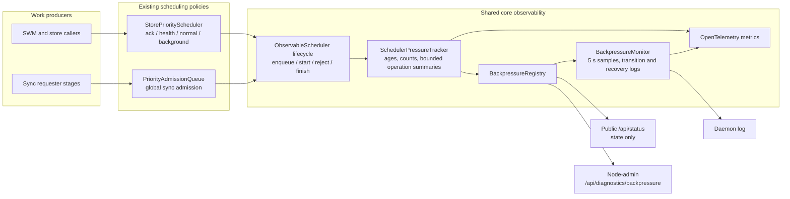

# Backpressure observability

DKG exposes one common pressure model for its in-memory schedulers. It answers
four questions without requiring scheduler-specific log archaeology:

1. Which scheduler and lane are under pressure?
2. Is work waiting, rejected, or admitted but possibly stuck?
3. Which bounded operation classes account for that work?
4. Did the scheduler recover?

This is an observability layer only. It does not change queue ordering,
concurrency, reservation, displacement, timeout, or retry behavior.

## Architecture



The tracker records references to bounded labels and timestamps, not work
closures or payloads. A snapshot can contain a maximum of eight queued and
eight active operation summaries per lane. Labels are sanitized and truncated
before they reach metrics, logs, or the diagnostics response.

The first registered sources are:

- `store`: the external-store priority scheduler and its `ack`, `health`,
  `normal`, and `background` lanes;
- `sync-global`: the process-wide sync admission queue and its sync lanes.

The two divide capacity differently, and every lane row names the model it is
reported under in its `capacityModel` field:

| `capacityModel` | Meaning | Source |
| --- | --- | --- |
| `partitioned` | The lane holds a private queue allocation and fills independently of its neighbours. Nothing validates the scheduler-level limit against the lane allocations — a scheduler may publish their sum (`store` does), or cap its total lower — so read a lane's own limit for lane pressure and the scheduler's for the rollup, and derive neither from the other. | `store` |
| `shared` | Every lane draws on one queue and one concurrency pool. The lane's `queueLimit`/`inflightLimit` **are** that pool's ceilings — the same number on every lane, never to be summed. | `sync-global` |

Three counts sit on every lane row beside the two ceilings, and they differ only under `shared`:

| Field | Meaning |
| --- | --- |
| `queued` | This lane's own backlog — *who* is waiting. The attribution signal. |
| `pressureQueued` | The depth the lane's `state` was classified against, and the numerator that belongs with `queueLimit`. Equal to `queued` for a `partitioned` lane, and the whole pool's depth for a `shared` lane **that has work waiting against a ceiling**. Where no depth applies to a shared lane — an empty backlog, or a pool with no `queueLimit` — nothing was classified on depth and the lane reports its own `queued`, so it never reads as utilized. |
| `pressureInflight` | The count that belongs with `inflightLimit`: this lane's own under a `partitioned` allocation, and on a `shared` row the pool's occupancy, **always** — it has none of `pressureQueued`'s fallbacks, because no state is ever classified on concurrency, so a shared row's ratio is a pool ratio by construction and cannot contradict the row's own state. |

So compute utilization from **`pressureQueued / queueLimit`**, never from `queued`, and no consumer has
to special-case the model. All three are optional on the type, so a scheduler written against an older
`dkg-core` still satisfies it: absent `capacityModel` means `partitioned`, absent `pressureQueued` means
`queued`, and absent `pressureInflight` means `inflight`.

### Attributing `sync-global` pressure to a trigger

The `lane` of a `sync-global` entry says *what kind of work* is queued
(`durable`, `changelog`, `shared_memory`, `swm_recovery`), but every trigger
funnels into the same few lanes. Its `operation` label therefore pairs the
collapsed work class with the **admission source** — the trigger that enqueued
it — as `<work class>:<source>`:

| Source | Trigger |
| --- | --- |
| `catchup-foreground` | explicit Context Graph catch-up (`POST /api/context-graph/subscribe`) |
| `catchup-background` | automatic post-approval / reconcile catch-up |
| `on-connect` | sync-on-connect after a peer dial |
| `reconcile` | the periodic sync reconciler |
| `vm-recovery` | foreground repair of specific missing Knowledge Assets |
| `swm-recovery` | curator-targeted shared-memory recovery |
| `unspecified` | a caller that did not declare an origin |

### Tuning foreground catch-up

Two knobs govern the foreground Context Graph catch-up that most often shows up
as `catchup-foreground` pressure. Both are read once at daemon start.

| Variable | Default | Effect |
| --- | --- | --- |
| `DKG_CATCHUP_STOP_ON_PROOF` | on | The catch-up walks peers in escalating waves and stops once the resolved curator has settled every requested plane. Set to `0`, `false`, `no`, or `off` to restore the previous behaviour: every sync-capable peer, both requested planes, no early stop. Use this if a graph ever lands short — foreground catch-up optimises for one authoritative payload, while breadth remains the background reconcile lane's job. |
| `DKG_CATCHUP_BACKPRESSURE_MAX_WAIT_MS` | `180000` | Wall-clock budget one foreground plane may spend being **refused** by local `sync-global` admission before the job reports a retryable `deferred`. Measured from before the first attempt, so an attempt's own queue time counts against it. It does not cancel a round the scheduler has already accepted — that one is doing real work and is bounded by `SYNC_TOTAL_TIMEOUT_MS`. The default sits above both a full head-of-line round (120 s) and the queue waits that motivated it. An explicit `0` disables retries; a blank value is treated as unset. |
| `DKG_CATCHUP_MAX_CONCURRENT_PEERS` | `4` | Caps in-flight per-peer sync rounds, and therefore the widest escalation wave. Raising it above the `sync-global` queue depth lets a single catch-up saturate the scheduler against itself. |

So `{"operation":"durable:catchup-foreground","count":4,"oldestAgeMs":109000}`
in a `queuedOperations` summary reads as "four explicit catch-up durable
admissions are queued, the oldest for 109 seconds", and the matching
`activeOperations` entry gives the same view for admitted work. Both halves are
closed sets, so the label space stays bounded (5 × 8) and, as before, no Context
Graph id or peer id ever reaches a metric, log line, or diagnostics response —
an unrecognized source is clamped to `unspecified`.

The sync **responder** limiter is a separate queue and is not instrumented, so
its `pre_authorization` and `responder` lanes appear in no snapshot, metric, or
log line. `sync-global` covers requester-side admission only.

Other schedulers can extend `ObservableScheduler` and call its protected
lifecycle methods at their existing admission boundaries. They keep complete
ownership of policy, and declare how their lanes divide capacity through
`capacityModel` — a scheduler that declares nothing is `partitioned`, and a lane
of a partitioned scheduler that publishes no limit of its own is simply not
classified on depth.

## Pressure states

| State | Meaning |
| --- | --- |
| `healthy` | No age, utilization, rejection, or active-duration threshold is crossed. |
| `degraded` | A queue is old or at least 75% utilized, but is not full. |
| `saturated` | A queue is full or an admission rejection occurred in the recent visibility window. |
| `stalled` | The oldest admitted operation crossed the scheduler's active-duration threshold. |

State precedence is `stalled` > `saturated` > `degraded` > `healthy`. A recent
rejection remains visible for 60 seconds so a short full-queue event is not
missed between monitor samples.

"A queue is full" means the queue that lane's work is actually waiting behind.
For a `partitioned` lane that is its own allocation. For a `shared` lane it is
the pool, so **every lane holding queued work reports the pool's pressure** —
one lane at 1 of a full pool of 4 is `saturated`, because the next admission in
that lane is the one that gets rejected. A lane with nothing queued stays
`healthy` however full the pool is: it is not being held back, and per-lane
`queued` and `queuedOperations` remain the attribution signal for who is. A log
line whose `pressureQueued` differs from its `queued` carries both for this
reason, and because the scheduler's own `lane: "all"` line is emitted only while
the rollup outranks every lane — which, on an all-shared scheduler, it never
does.

These states describe evidence, not root cause. For example, a stalled store
operation can be caused by Blazegraph, Oxigraph, disk, or a caller that never
settles. Use the operation summary and surrounding store logs to continue the
investigation.

## Read current pressure

`GET /api/status` is public and includes only the aggregate state:

```json
{
  "backpressure": {
    "state": "degraded",
    "schedulers": [
      { "scheduler": "store", "state": "degraded" },
      { "scheduler": "sync-global", "state": "healthy" }
    ],
    "diagnosticsAvailable": "/api/diagnostics/backpressure"
  }
}
```

The detailed route requires the node-level admin token. Agent-scoped tokens are
rejected because the response describes node-wide work.

```bash
TOKEN=$(dkg auth show)
curl -sS \
  -H "Authorization: Bearer $TOKEN" \
  http://127.0.0.1:9200/api/diagnostics/backpressure | jq
```

The response reports current queue/inflight counts and limits, oldest ages,
cumulative lifecycle/rejection counts, and bounded operation summaries. It
does not expose request bodies, SPARQL text, graph or peer identifiers, work
closures, or durable queue payloads.

## Log behavior

The daemon samples registered sources every five seconds. It emits:

- a warning immediately when a lane enters or changes a non-healthy state;
- one warning summary per minute while that state persists;
- an info message when the lane recovers.

All messages start with `[backpressure]` and carry a JSON object:

```text
[warn] [backpressure] {"event":"transition","scheduler":"store","lane":"normal","state":"degraded","previousState":"healthy","queued":3,"queueLimit":4,"inflight":4,"inflightLimit":4,"oldestQueuedAgeMs":15234,"oldestActiveAgeMs":19310,"rejectedTotal":0,"queuedOperations":[{"operation":"blazegraph.query","count":3,"oldestAgeMs":15234}],"activeOperations":[{"operation":"publisher.swm.graphScopedReplace","count":4,"oldestAgeMs":19310}]}
```

Per-item enqueue/start logs are deliberately avoided. Transition and periodic
summary logging make sustained pressure visible without creating a log storm
that competes with the overloaded scheduler.

## Metrics

The common OpenTelemetry instruments use bounded `scheduler` and `lane`
attributes:

| Metric | Type | Purpose |
| --- | --- | --- |
| `dkg.backpressure.queue_depth` | gauge | Current waiting work in this lane — the attribution signal |
| `dkg.backpressure.pressure_depth` | gauge | The depth this lane's state was classified against. **Divide this by `queue_limit` for utilization**, not `queue_depth`: on a `shared` lane the limit is the pool's, so pairing it with the lane's own backlog underreports. Equal to `queue_depth` on a `partitioned` lane |
| `dkg.backpressure.queue_limit` | gauge | Configured queue capacity |
| `dkg.backpressure.inflight` | gauge | Current admitted work in this lane — attribution |
| `dkg.backpressure.pressure_inflight` | gauge | The admitted count `inflight_limit` bounds — this lane's own under `partitioned`, the pool's under `shared` |
| `dkg.backpressure.inflight_limit` | gauge | Configured concurrency |
| `dkg.backpressure.oldest_queued_age_ms` | gauge | Head-of-line age |
| `dkg.backpressure.oldest_active_age_ms` | gauge | Oldest admitted duration |
| `dkg.backpressure.events_total` | counter | Lifecycle and rejection events |
| `dkg.backpressure.queue_wait_ms` | histogram | Completed queue waits |
| `dkg.backpressure.active_duration_ms` | histogram | Completed admitted durations |

Like the lane `queueLimit`/`inflightLimit` they pair with, `pressure_depth` and
`pressure_inflight` **must never be summed across lanes** on a `shared`
scheduler: every lane reports the same pool figure, and the `lane="all"` row
carries the scheduler's own totals under the same instrument names, so a `sum()`
without a lane filter double-counts on every scheduler.

Operation names are intentionally excluded from the common current-value
gauges. They remain available in bounded diagnostic/log summaries, while
metrics retain predictable cardinality.

## Failure containment

Instrumentation is fail-open:

- metric recording failures do not alter admission or completion;
- one broken source is reported in the registry's `failures` array without
  hiding healthy sources;
- log callback failures do not stop the monitor;
- the monitor timer is unreferenced and is stopped during daemon shutdown.
