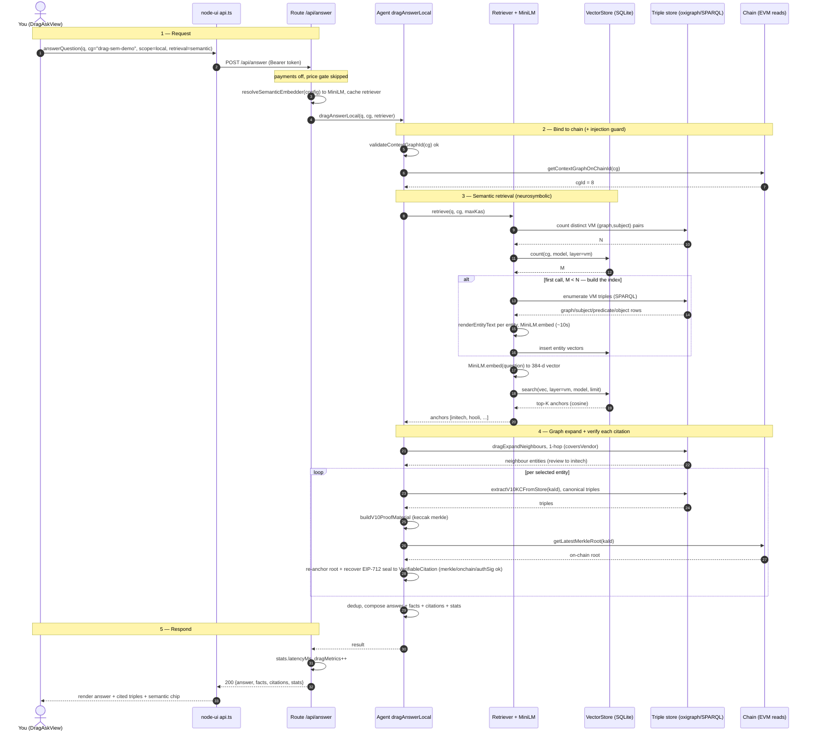
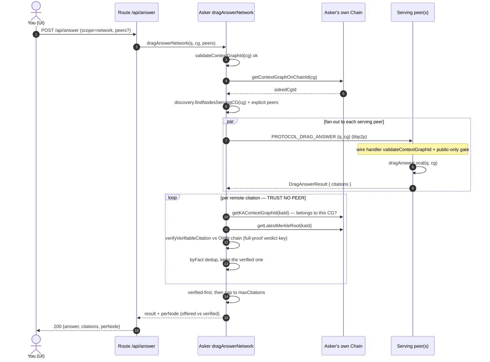
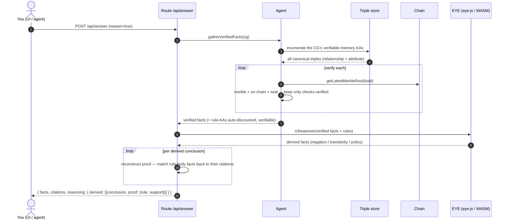

# dRAG — request → answer sequence

How a natural-language question becomes a grounded, verifiable answer (OT-RFC-55).
Two flows: a single node (`scope:local`, the semantic-retrieval demo) and the
cross-node fan-out (`scope:network`).

> **Preview in VS Code:** open the Markdown preview (`⇧⌘V`). If the diagrams show as
> code, install the **“Markdown Preview Mermaid Support”** extension (bierner.markdown-mermaid).

---

## 1. Single node — `scope:local`, `retrieval:semantic`

This is the exact path a UI question takes on `drag-sem-demo`.

**Reading it:**
- The `alt` block (first-call index build) is the ~10 s you see once per CG. Later
  questions skip straight to *embed-question → ANN search*.
- The `loop` block is where trust comes from: every candidate fact is re-proven
  against the **live on-chain root**, so the vector index above it can be an
  approximate, offline, even stale *hint* without weakening the answer.

---

## 2. Cross-node — `scope:network`

The asking node holds none of the CG; it fans out to serving peers and
**re-verifies every returned citation against its own chain** before trusting it.

**Reading it:**
- A serving peer’s self-reported verdict is **never trusted** — the asker re-stamps
  every citation with its *own* `verifyVerifiableCitation` result.
- The CG-scope check (`getKAContextGraphId`) drops a genuinely-verifiable fact that
  belongs to a *different* CG (the scope-swap defense).
- The verdict cache is keyed on the **full proof**, and the citation cap is filled
  **verified-first**, so one malicious/early peer can neither poison an honest
  verdict nor starve honest verified facts out of the answer.

---

## The one idea

The **vector index is an untrusted hint**; the **citation is the truth**. Retrieval
(neural + 1-hop graph) only *proposes* which facts are relevant — fast, approximate,
decentralizable. Every fact returned is independently auditable against the chain,
which is why a normal RAG’s “the retrieved chunk *is* the answer” failure mode does
not apply here.

---

## 3. Reasoning — `reason:true` (retrieve · verify · **reason** · prove)

The EYE reasoner derives *new* conclusions over the verified facts, each carrying a
proof = {the chain-verified support facts} + {the rule}.

Note the trust gates: only `checks.verified` facts ever reach EYE (step 9), and a
derived conclusion is returned in `reasoning.derived` — never mixed into the
published `facts`/`citations`. A reasoner can mis-derive; it can never forge a fact.
