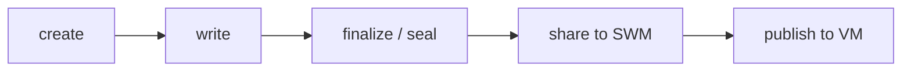

# Knowledge Asset Lifecycle CLI

Use `dkg knowledge-asset ...` or its short alias `dkg ka ...` for named Knowledge Asset work:



## One-shot WM to SWM

```bash
dkg ka create notes \
  --context-graph-id my-project \
  --input-file ./notes.ttl \
  --share
```

This creates the KA named `notes`, writes RDF from `--input-file`, finalizes the draft, and shares it to Shared Working Memory. It does not publish to Verifiable Memory.

`-f` is a short alias for `--input-file`. Prefer `--input-file <path>` in scripts and docs so the local payload source is never confused with the positional KA `<name>`.

## Step-by-step Lifecycle

```bash
dkg ka create notes -c my-project
dkg ka write notes -c my-project --input-file ./notes.ttl
dkg ka finalize notes -c my-project
dkg ka share notes -c my-project
dkg ka publish notes -c my-project
```

Use `dkg ka publish-async notes -c my-project` for an async VM publish job. `dkg publisher publish-async my-project notes` remains an operational alias.

Async VM publish requires the async publisher to be enabled and backed by publisher wallets with native gas plus PCA registration or TRAC for direct spend. Publisher wallet node identity is optional attribution: if the wallet resolves to identity `0`, the publish runs in no-attribution mode. Use `--publisher-node-identity-id 0` to force no-attribution for one publish. See [Async Publisher Wallets](async-publisher-wallets.md).

## Command Reference

| Command | Purpose |
|---|---|
| `dkg ka create <name> -c <cg> [--input-file <rdf>] [--share]` | Create a WM draft; optionally write/finalize/share in one call |
| `dkg ka write <name> -c <cg> --input-file <rdf>` | Append RDF payload quads |
| `dkg ka import-file <name> -c <cg> --input-file <file>` | Extract a local document into WM |
| `dkg ka extraction-status <name> -c <cg>` | Check document extraction status |
| `dkg ka finalize <name> -c <cg>` | Seal the WM draft |
| `dkg ka share <name> -c <cg>` | Share finalized WM to SWM |
| `dkg ka share-async <name> -c <cg>` | Enqueue async WM-to-SWM share |
| `dkg ka share-jobs [--context-graph-id <cg>] [--state <states>] [--limit <n>]` | List async share jobs |
| `dkg ka share-job <job-id>` | Show one async share job |
| `dkg ka cancel-share-job <job-id>` | Cancel a queued/retrying share job |
| `dkg ka recover-share-job <job-id>` | Recover a failed share job |
| `dkg ka publish <name> -c <cg>` | Synchronously publish finalized, fully shared SWM to VM |
| `dkg ka publish-async <name> -c <cg> [--publisher-node-identity-id 0]` | Enqueue VM publish |
| `dkg ka pull-from <name> -c <cg> --layer swm|vm` | Seed WM from SWM or VM |
| `dkg ka discard <name> -c <cg>` | Discard a WM draft |
| `dkg ka query <name> -c <cg>` | Read WM quads |
| `dkg ka history <name> -c <cg>` | Read lifecycle descriptor |

`dkg assertion ...` remains as compatibility for older document import/query/promote flows. New docs and agents should prefer `dkg ka ...`.
