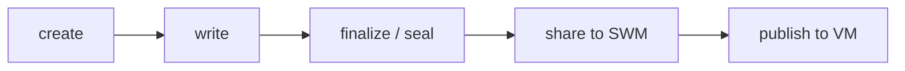

# Knowledge Asset Lifecycle CLI

Use `dkg knowledge-asset ...` or its short alias `dkg ka ...` for named Knowledge Asset work:


```mermaid
flowchart LR
  Create["create"] --> Write["write"]
  Write --> Finalize["finalize / seal"]
  Finalize --> Share["share to SWM"]
  Share --> Publish["publish to VM"]
```

## One-shot WM to SWM

```bash
dkg ka create notes \
  --context-graph-id my-project \
  --input-file ./notes.ttl \
  --share
```

This creates the KA named `notes`, writes RDF from `--input-file`, finalizes the draft, and shares it to Shared Working Memory. It does not publish to Verifiable Memory.

`-f` is a short alias for `--input-file`. Prefer `--input-file <path>` in scripts and docs so the local payload source is never confused with the positional KA `<name>`.

## Step-by-step Lifecycle

```bash
dkg ka create notes -c my-project
dkg ka write notes -c my-project --input-file ./notes.ttl
dkg ka finalize notes -c my-project
dkg ka share notes -c my-project
dkg ka publish notes -c my-project
```

Use `dkg ka publish-async notes -c my-project` for an async VM publish job. `dkg publisher publish-async my-project notes` remains an operational alias.

Async VM publish requires the async publisher to be enabled and backed by publisher wallets with native gas plus PCA registration or TRAC for direct spend. Publisher wallet node identity is optional attribution: if the wallet resolves to identity `0`, the publish runs in no-attribution mode. Use `--publisher-node-identity-id 0` to force no-attribution for one publish. See [Async Publisher Wallets](async-publisher-wallets.md).

## Editing a published Knowledge Asset

```bash
dkg ka pull-from notes -c my-project --layer vm
dkg ka write notes -c my-project --input-file ./notes-v2.ttl
dkg ka finalize notes -c my-project
dkg ka share notes -c my-project
dkg ka publish notes -c my-project
```

`pull-from` re-opens the published (or shared) content as a new WM draft; `--on-conflict replace` replaces a draft that already exists. An update is published as the version **one above the KA's latest confirmed version**, and `finalize` seals the draft with that number (`assertionVersion` in the `wm/finalize` response). Because the number comes from the confirmed version, a finalized draft that you abandon — you edit again, discard it, or `pull-from` over it — does not use up a number: the next draft is numbered the same.

If a finalized update carries a different number (it was sealed by an older node, or the published version moved on in the meantime) the node refuses it before anything is staged or sent — `409 PUBLISH_INTENT_STALE`, naming the two numbers — instead of failing later as a retryable publish error. Recover with `dkg ka pull-from <name> -c <cg> --layer swm` (`--layer vm` when the published version moved on; then re-apply your edits), `finalize`, `share`, and publish again. An async publish job that already failed for the KA keeps owning it until it is cleared (`dkg publisher clear failed`, or `POST /api/publisher/clear-job` for one job); retry skips a job whose budget is spent.

A core that already ACK-signed the abandoned draft declines its replacement transiently during `DKG_STORAGE_ACK_PENDING_TX_WINDOW_MS` (5 minutes by default); retry after that window. Upgraded peers accept a newer authenticated share at the same unpublished number, and a recovered burned draft may move to a lower number when a coherent chain view proves both drafts are unpublished. Older shares cannot regress the replacement. Private payloads are retained by sealed commitment, so an earlier shared draft remains reopenable after a replacement is finalized. Peers running older receiver code retain the previous draft behavior until upgraded.

## Synchronous share failures

`dkg ka share` (`POST /api/knowledge-assets/<name>/swm/share`) can answer `503` in two cases. Both are retryable. In both the answer carries `retryable: true`, `retryAction: resume_existing_knowledge_asset`, `retryPhase: swm-share`, the `contextGraphId` and `retryKnowledgeAssetName`: send the same share for the same name again, and do not create a replacement asset.

| `code` | What happened | What to do |
|---|---|---|
| `PROMOTE_RETRYABLE_FAILURE` | Something the share depends on was temporarily unavailable, so the share did not complete. | Wait for `Retry-After` (1 second), then share again. |
| `PROMOTE_POST_COMMIT_FAILURE` | Shared Working Memory was written, but a step after it failed. | Share again; the node repairs the same share operation. |

`PROMOTE_RETRYABLE_FAILURE` usually means the node could not confirm, at that moment, who may read the Context Graph. A share into a private Context Graph is encrypted to the graph's current members, and the node accepts a member list only if it could read it from the chain and from its own metadata without either changing during the read. This is most likely straight after a Context Graph is registered, while the node is still settling the new graph's subscriptions, and while chain RPC is slow or unreachable. The node repeats the read on its own for a short time (about two seconds at most) before it answers, so a brief gap is not visible to the caller.

After this answer nothing is lost and the content is unchanged, but the request was not a no-op. The share seals the draft before it shares, so the asset is now at least `wm-sealed` (see `dkg ka history`), and whatever the share had already recorded is reused by the next attempt. Do not write to the asset or recreate it: share it again. Publish only after the share has succeeded.

The daemon log names what was unavailable: the event `knowledge_asset_share_prerequisite_unavailable` carries the share `step` and, when known, a `causeCode` and `causeReason`. An async share (`dkg ka share-async`) that meets the same failure is retried by the queue as `failed_retrying`. A one-shot create with `--share` keeps what it created: when only its share step fails this way, it answers `207` with the sealed asset and the share error under `errors`; finish with `dkg ka share <name>`.

## Async share recovery

Use `dkg ka share-job <job-id>` to observe an accepted async share. A `failed_retrying` job follows the queue's existing backoff and attempt limit; do not submit another share to restart it.

If the worker cannot save or read a promotion failure, the `async_promote_failure_bookkeeping_uncertain` log event identifies the affected job and bookkeeping stage. This event does not establish whether promotion changed SWM. A result already saved in the queue remains authoritative. Otherwise, the job can remain `running` until its lease expires (15 minutes by default), after which ordinary queue polling or startup recovery reconciles it. A started promotion with uncertain effects becomes an explicit **partial promote ambiguity** inspection hold. Inspect its SWM/VM state before recovery; do not blindly reshare or reset its retry budget.

Genuine fatal operation failures still become terminal, and a successfully saved retryable failure still uses normal automatic retry. A bookkeeping outage alone does not justify an immediate fatal asset verdict.

If the share committed but the node then failed to record its `swmCurrentAssertion` lifecycle pointer, the job is never reported as `succeeded` and the asset keeps its share operation id. A store failure that is known not to have started is retried directly (`failed_retrying` with a `nextRetryAt`). Any other failure is recorded as `failed`, with `lastError.code: fatal` and `lastError.diagnosticCode: PROMOTE_POST_COMMIT_FAILURE`. The daemon's recovery sweep runs at startup and every 30 seconds; until that sweep the job remains `failed`. This deliberate delay lets the existing durable sweep own bounded replay and avoids another immediate store scan under queue pressure. While the job is within its automatic recovery budget, `clear` rejects it as `nonterminal` and cannot remove its repair evidence. The sweep requeues the same share with normal backoff and the same attempt budget. Its `failed_retrying` row keeps the classification and diagnostic but reports `lastError.retryable: true`. Exhausted or operator-held jobs remain available for inspection and explicit recovery. A synchronous share request reports `503`, `retryable: true`, and `retryAction: resume_existing_knowledge_asset`: retry the same name and share operation rather than creating a replacement asset.

## Command Reference

| Command | Purpose |
|---|---|
| `dkg ka create <name> -c <cg> [--input-file <rdf>] [--share]` | Create a WM draft; optionally write/finalize/share in one call |
| `dkg ka write <name> -c <cg> --input-file <rdf>` | Append RDF payload quads |
| `dkg ka import-file <name> -c <cg> --input-file <file>` | Extract a local document into WM |
| `dkg ka extraction-status <name> -c <cg>` | Check document extraction status |
| `dkg ka finalize <name> -c <cg>` | Seal the WM draft |
| `dkg ka share <name> -c <cg>` | Share finalized WM to SWM |
| `dkg ka share-async <name> -c <cg>` | Enqueue async WM-to-SWM share |
| `dkg ka share-jobs [--context-graph-id <cg>] [--state <states>] [--limit <n>]` | List async share jobs |
| `dkg ka share-job <job-id>` | Show one async share job |
| `dkg ka cancel-share-job <job-id>` | Cancel a queued/retrying share job |
| `dkg ka recover-share-job <job-id>` | Recover a failed share job |
| `dkg ka publish <name> -c <cg>` | Synchronously publish finalized, fully shared SWM to VM |
| `dkg ka publish-async <name> -c <cg> [--publisher-node-identity-id 0]` | Enqueue VM publish |
| `dkg ka pull-from <name> -c <cg> --layer swm|vm` | Seed WM from SWM or VM |
| `dkg ka discard <name> -c <cg>` | Discard a WM draft |
| `dkg ka query <name> -c <cg>` | Read WM quads |
| `dkg ka history <name> -c <cg>` | Read lifecycle descriptor |

`dkg assertion ...` remains as compatibility for older document import/query/promote flows. New docs and agents should prefer `dkg ka ...`.


A finalized draft that has not been shared can be reopened with `dkg ka pull-from notes --layer wm -c my-project`. The daemon verifies the complete sealed public/private payload before clearing the active seal; a damaged source remains unchanged. Finalization holds the KA lifecycle lock through signing, and derives its assertion number from coherent chain or confirmed VM evidence rather than requiring the best-effort VM pointer. History exposes `assertionVersion` separately from the stable `kaNumber`.

Deterministic missing-target, invalid-target, ownership, legacy-read-only and stale-version errors end queued jobs as pre-send failures. Transient RPC/store failures retain their existing retry lanes; a persisted transaction always retains its recovery evidence. Duplicate-job HTTP409 responses include `ASYNC_LIFT_JOB_CONFLICT` and the existing job ID.

Abandoned draft maintenance runs in bounded batches. It retires superseded public operation snapshots after the pending ACK window, preserving current or equivalent heads, signed ACK copies, lifecycle references, and every persisted publish job until explicit clear. Private collection only removes unreferenced versions above the coherently confirmed next draft; historical, current, and next versions remain available. Incomplete queue coverage suspends both this maintenance and the older TTL sweep. Queue admission and retirement share a reference fence, so a late publish request for a retired operation returns `PUBLISH_INTENT_STALE` without creating a stranded job.
