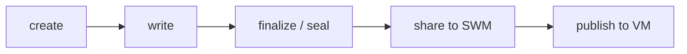

# Knowledge Asset Lifecycle CLI

Use `dkg knowledge-asset ...` or its short alias `dkg ka ...` for named Knowledge Asset work:


```mermaid
flowchart LR
  Create["create"] --> Write["write"]
  Write --> Finalize["finalize / seal"]
  Finalize --> Share["share to SWM"]
  Share --> Publish["publish to VM"]
```

## One-shot WM to SWM

```bash
dkg ka create notes \
  --context-graph-id my-project \
  --input-file ./notes.ttl \
  --share
```

This creates the KA named `notes`, writes RDF from `--input-file`, finalizes the draft, and shares it to Shared Working Memory. It does not publish to Verifiable Memory.

`-f` is a short alias for `--input-file`. Prefer `--input-file <path>` in scripts and docs so the local payload source is never confused with the positional KA `<name>`.

## Step-by-step Lifecycle

```bash
dkg ka create notes -c my-project
dkg ka write notes -c my-project --input-file ./notes.ttl
dkg ka finalize notes -c my-project
dkg ka share notes -c my-project
dkg ka publish notes -c my-project
```

Use `dkg ka publish-async notes -c my-project` for an async VM publish job. `dkg publisher publish-async my-project notes` remains an operational alias.

Async VM publish requires the async publisher to be enabled and backed by publisher wallets with native gas plus PCA registration or TRAC for direct spend. Publisher wallet node identity is optional attribution: if the wallet resolves to identity `0`, the publish runs in no-attribution mode. Use `--publisher-node-identity-id 0` to force no-attribution for one publish. See [Async Publisher Wallets](async-publisher-wallets.md).

## Async share recovery

Use `dkg ka share-job <job-id>` to observe an accepted async share. A `failed_retrying` job follows the queue's existing backoff and attempt limit; do not submit another share to restart it.

If the worker cannot save or read a promotion failure, the `async_promote_failure_bookkeeping_uncertain` log event identifies the affected job and bookkeeping stage. This event does not establish whether promotion changed SWM. A result already saved in the queue remains authoritative. Otherwise, the job can remain `running` until its lease expires (15 minutes by default), after which ordinary queue polling or startup recovery reconciles it. A started promotion with uncertain effects becomes an explicit **partial promote ambiguity** inspection hold. Inspect its SWM/VM state before recovery; do not blindly reshare or reset its retry budget.

Genuine fatal operation failures still become terminal, and a successfully saved retryable failure still uses normal automatic retry. A bookkeeping outage alone does not justify an immediate fatal asset verdict.

If the share committed but the node then failed to record its `swmCurrentAssertion` lifecycle pointer, the job is never reported as `succeeded` and the asset keeps its share operation id. A store failure that is known not to have started is retried directly (`failed_retrying`). Any other failure is recorded as `failed` with `lastError.diagnosticCode` `PROMOTE_POST_COMMIT_FAILURE`; unlike other `failed` jobs, the daemon automatically requeues it (with the normal backoff and within the job's attempt limit) to repair the pointer, so do not `clear` such a job or submit another share while it recovers.

## Command Reference

| Command | Purpose |
|---|---|
| `dkg ka create <name> -c <cg> [--input-file <rdf>] [--share]` | Create a WM draft; optionally write/finalize/share in one call |
| `dkg ka write <name> -c <cg> --input-file <rdf>` | Append RDF payload quads |
| `dkg ka import-file <name> -c <cg> --input-file <file>` | Extract a local document into WM |
| `dkg ka extraction-status <name> -c <cg>` | Check document extraction status |
| `dkg ka finalize <name> -c <cg>` | Seal the WM draft |
| `dkg ka share <name> -c <cg>` | Share finalized WM to SWM |
| `dkg ka share-async <name> -c <cg>` | Enqueue async WM-to-SWM share |
| `dkg ka share-jobs [--context-graph-id <cg>] [--state <states>] [--limit <n>]` | List async share jobs |
| `dkg ka share-job <job-id>` | Show one async share job |
| `dkg ka cancel-share-job <job-id>` | Cancel a queued/retrying share job |
| `dkg ka recover-share-job <job-id>` | Recover a failed share job |
| `dkg ka publish <name> -c <cg>` | Synchronously publish finalized, fully shared SWM to VM |
| `dkg ka publish-async <name> -c <cg> [--publisher-node-identity-id 0]` | Enqueue VM publish |
| `dkg ka pull-from <name> -c <cg> --layer swm|vm` | Seed WM from SWM or VM |
| `dkg ka discard <name> -c <cg>` | Discard a WM draft |
| `dkg ka query <name> -c <cg>` | Read WM quads |
| `dkg ka history <name> -c <cg>` | Read lifecycle descriptor |

`dkg assertion ...` remains as compatibility for older document import/query/promote flows. New docs and agents should prefer `dkg ka ...`.
