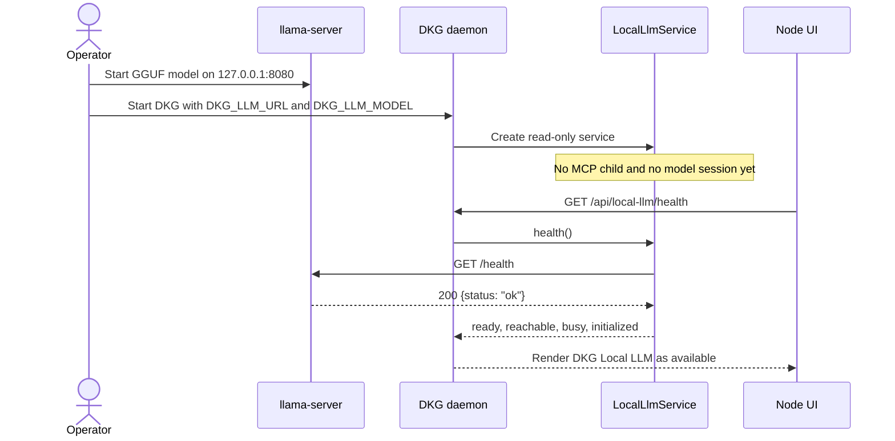
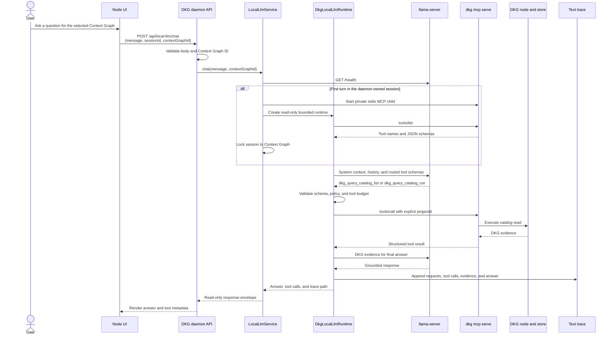
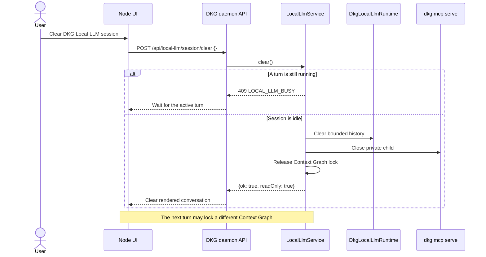
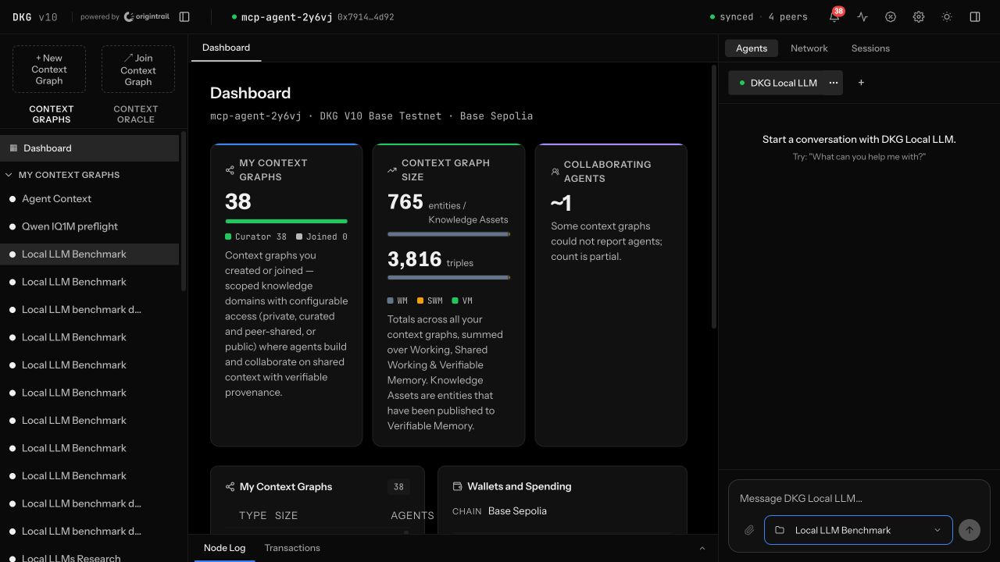
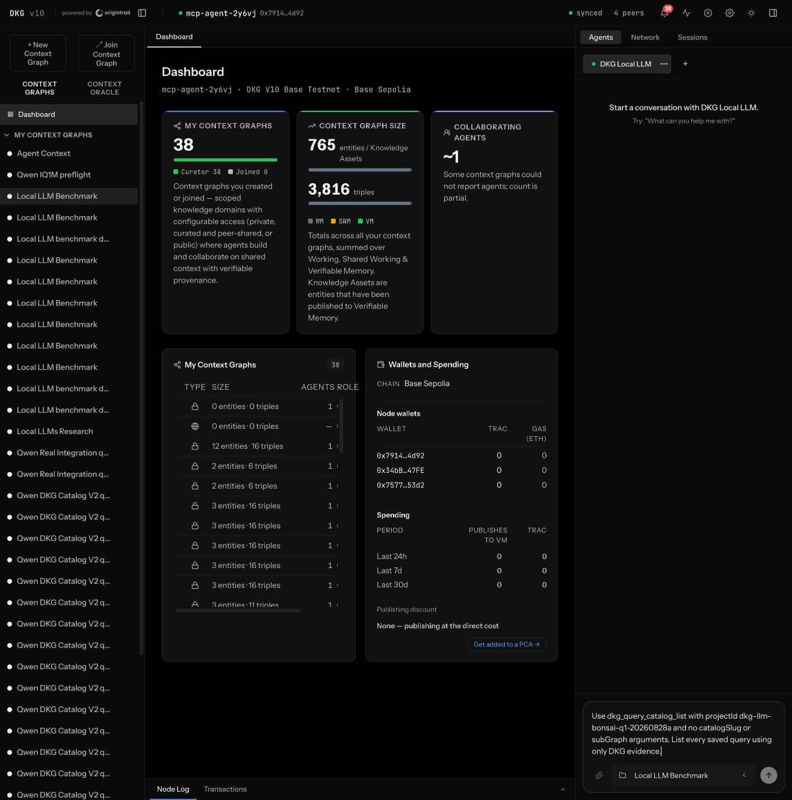
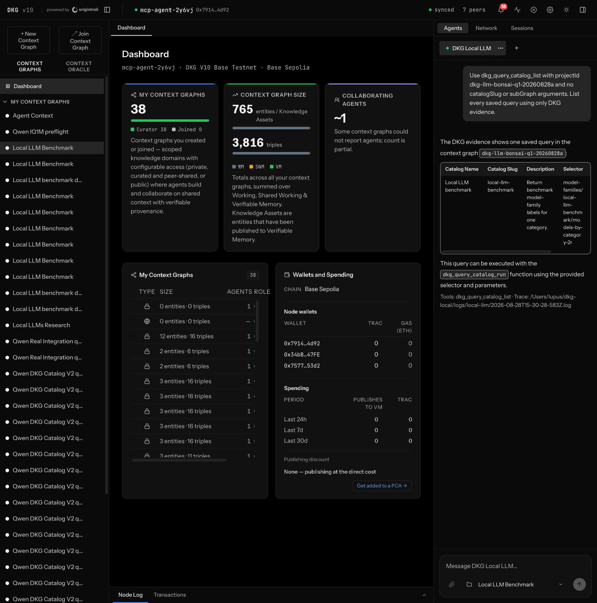
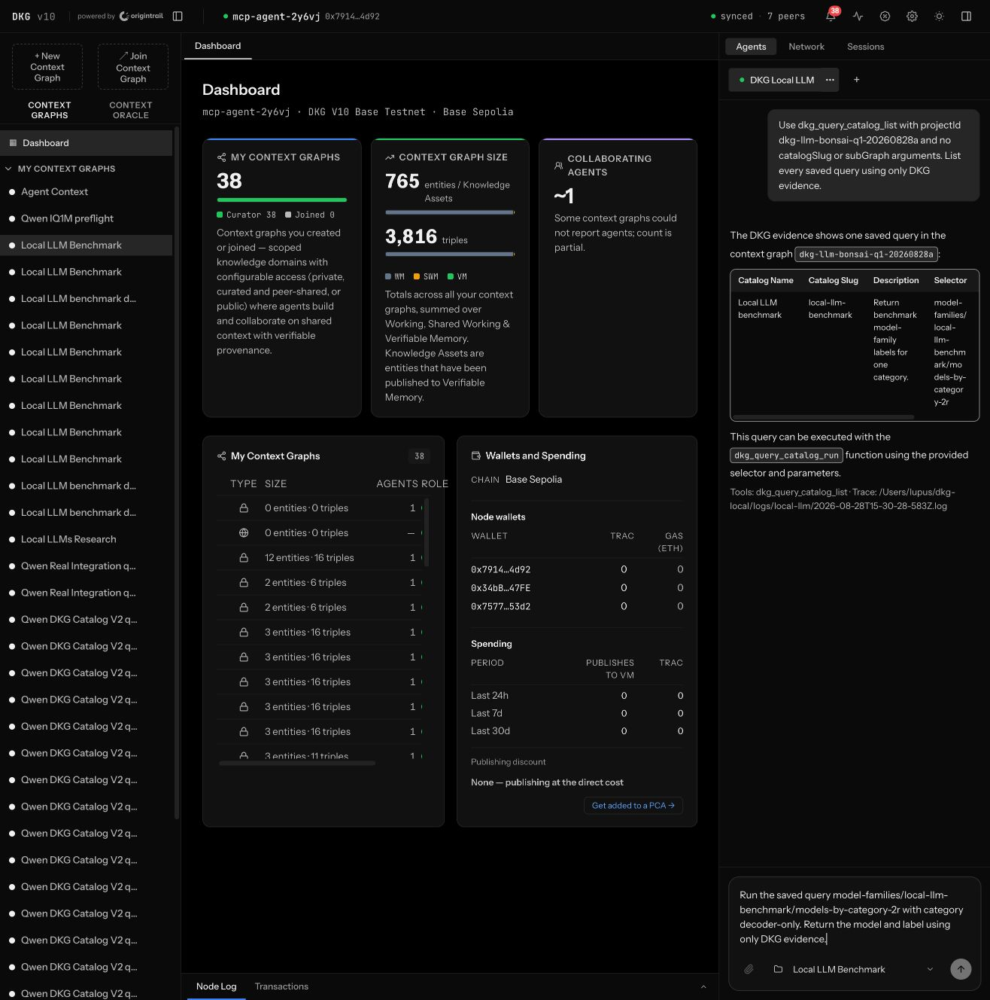
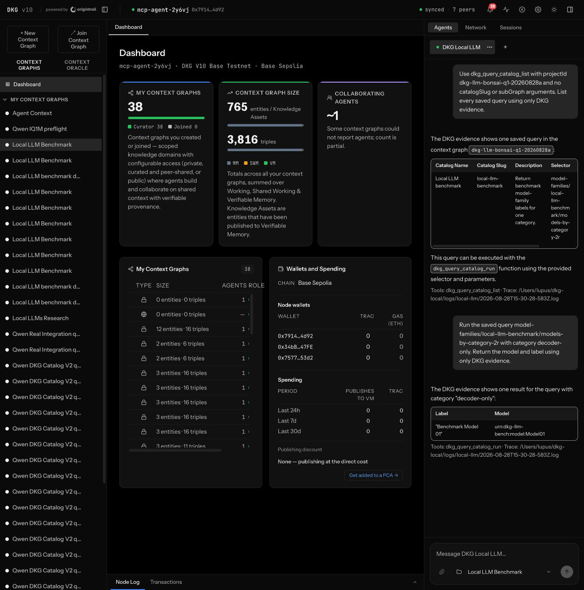

# Run a Local LLM with DKG

Use this guide to connect a local GGUF model to the DKG MCP tools through the
OpenAI-compatible `llama.cpp` server. The model does not connect to the DKG
daemon directly: `dkg llm` starts an MCP client, discovers the available tools
with `tools/list`, validates every tool call, and writes a readable interaction
trace.

The runtime is read-only by default. Write tools are exposed only with
`--allow-write`, and the user must still explicitly request the mutation.

If you are delegating setup to a coding agent, give it the dedicated
[`Local LLM Agent Runbook`](local-llm-agent-runbook.md). It contains a
copy-paste instruction, model decision table, Query Catalog gate, exact launch
commands, and completion checks.

## Proposal: use llama.cpp as the reference LLM server

Use [`llama.cpp`](https://github.com/ggml-org/llama.cpp) and its
`llama-server` executable as the default, documented local inference server for
DKG.

This selects the inference runtime, not the model family: `llama-server` can
serve Qwen, Bonsai, Llama, and other compatible GGUF models. Qwen3-8B Q4_K_M
remains the recommended model below.

The boundary should remain explicit:

- `llama-server` is an operator-managed process. DKG does not silently install,
  upgrade, start, or stop it.
- `dkg llm` owns the MCP client, tool discovery, metadata-driven relevance
  routing, DKG system context, schema validation, retry policy, bounded chat
  history, and text trace.
- Do not bypass that harness by attaching the DKG MCP server directly through
  llama.cpp's own MCP configuration. That would skip DKG's tested system
  context, tool-budget routing, validation, retry, and readable interaction log.
- The default endpoint is
  `http://127.0.0.1:8080/v1/chat/completions`; `--llama-url` and `DKG_LLM_URL`
  remain escape hatches for another compatible server.
- A supported server build must provide `llama-server`, GGUF model loading,
  Jinja chat templates, the OpenAI-compatible chat-completions endpoint, and
  the public `/health` endpoint.
- Keep the server bound to `127.0.0.1` by default. Remote or LAN exposure needs
  an explicit authentication and network-security decision.

This gives DKG one reproducible reference path across macOS, Linux, and
Windows without making the local-LLM client llama.cpp-specific internally. The
upstream server documents the OpenAI-compatible API and reports readiness with
HTTP 200 plus `{"status":"ok"}`.

## Install llama.cpp and llama-server

Prefer an operating-system package for normal use. Build from source when a
specific acceleration backend or an unreleased upstream fix is required. The
canonical upstream references are the
[`llama.cpp` installation guide](https://github.com/ggml-org/llama.cpp/blob/master/docs/install.md),
[`build guide`](https://github.com/ggml-org/llama.cpp/blob/master/docs/build.md),
and [`llama-server` guide](https://github.com/ggml-org/llama.cpp/blob/master/tools/server/README.md).

### macOS

Homebrew is the recommended installation:

```bash
brew install llama.cpp
command -v llama-server
llama-server --version
```

The Homebrew formula supports both Apple Silicon and Intel macOS. Apple Metal
acceleration is enabled by default in upstream macOS builds.

To build the server from source instead:

```bash
xcode-select --install
brew install cmake git
git clone https://github.com/ggml-org/llama.cpp.git
cd llama.cpp
cmake -S . -B build -DCMAKE_BUILD_TYPE=Release
cmake --build build --config Release --target llama-server --parallel
./build/bin/llama-server --version
```

Use the resulting absolute path, normally
`<llama.cpp>/build/bin/llama-server`, in the launch commands below.

### Linux

If Homebrew is already installed, the shortest supported path is:

```bash
brew install llama.cpp
command -v llama-server
llama-server --version
```

Conda is an official cross-platform alternative:

```bash
conda install -c conda-forge llama.cpp
command -v llama-server
llama-server --version
```

For an Ubuntu/Debian CPU build from source:

```bash
sudo apt-get update
sudo apt-get install -y build-essential cmake git
git clone https://github.com/ggml-org/llama.cpp.git
cd llama.cpp
cmake -S . -B build -DCMAKE_BUILD_TYPE=Release
cmake --build build --config Release --target llama-server --parallel
./build/bin/llama-server --version
```

For NVIDIA acceleration, install a compatible NVIDIA driver and CUDA toolkit,
then configure the same source checkout with the CUDA backend:

```bash
cmake -S . -B build -DGGML_CUDA=ON -DCMAKE_BUILD_TYPE=Release
cmake --build build --config Release --target llama-server --parallel
./build/bin/llama-server --version
```

Use upstream prebuilt release assets or the backend-specific build guide for
Vulkan, ROCm/HIP, SYCL, or OpenVINO rather than guessing backend flags.

### Windows

Open PowerShell and install the upstream Winget package:

```powershell
winget install llama.cpp
```

Open a new PowerShell after installation, then verify the executable:

```powershell
Get-Command llama-server.exe
llama-server.exe --version
```

For a source build, install Visual Studio 2022 with the **Desktop development
with C++** workload, including CMake and Git. In a **Developer PowerShell for
VS 2022** run:

```powershell
git clone https://github.com/ggml-org/llama.cpp.git
Set-Location llama.cpp
cmake -S . -B build
cmake --build build --config Release --target llama-server
& .\build\bin\Release\llama-server.exe --version
```

If the selected CMake generator places the executable directly under
`build\bin`, use that discovered path. For NVIDIA acceleration, prefer the
matching CUDA prebuilt asset from the official
[`llama.cpp` releases](https://github.com/ggml-org/llama.cpp/releases), or build
with `-DGGML_CUDA=ON` after installing the CUDA toolkit.

### Optional portable Docker server

On a machine with Docker, the official CPU server image avoids a host build:

```bash
docker run --rm \
  -p 127.0.0.1:8080:8080 \
  ghcr.io/ggml-org/llama.cpp:server \
  -hf Qwen/Qwen3-8B-GGUF:Q4_K_M \
  -c 8192 \
  --jinja \
  --host 0.0.0.0 \
  --port 8080
```

Use the upstream `server-cuda` image and `--gpus all` only on a correctly
configured NVIDIA Docker host.

### Optional Hugging Face CLI

Public models used with `llama-server -hf` do not require a separate `hf`
download step. Install the current `hf` CLI when a model is gated, private, or
must be resolved to an explicit local GGUF path.

macOS and Linux:

```bash
curl -LsSf https://hf.co/cli/install.sh | bash
hf auth login
hf auth whoami
```

Windows PowerShell:

```powershell
powershell -ExecutionPolicy ByPass -c "irm https://hf.co/cli/install.ps1 | iex"
hf auth login
hf auth whoami
```

Do not put a Hugging Face token in a command line, repository file, or DKG
interaction log. Use `hf auth login` or the `HF_TOKEN` environment variable.

### Verify the server contract

Start one of the models below, wait for loading to finish, and verify both
readiness and the OpenAI-compatible surface:

```bash
curl -sS http://127.0.0.1:8080/health
curl -sS http://127.0.0.1:8080/v1/models
```

Windows PowerShell can use `curl.exe` with the same URLs. Do not start
`dkg llm` until `/health` returns HTTP 200 and `{"status":"ok"}`.

## Recommended model

Use **Qwen3-8B Q4_K_M** as the default local model. It provided the strongest
tool-calling result in the real-DKG benchmark on the reference 16 GB Apple
Silicon machine.

| Model and quantization | Real-DKG score | Relative resource use | Recommendation |
| --- | ---: | --- | --- |
| Qwen3-8B Q4_K_M | 13/13 | Medium | Recommended default for chat, catalog use, reads, and bounded writes |
| Bonsai-8B Q1_0 | 8/13 | Low | Use only with a pre-built Query Catalog and a narrowly routed tool set |
| Qwen3.8-27B UD-IQ1_M | 9/13 | High memory pressure and very slow on 16 GB | Not recommended on 16 GB; the 1-bit quantization did not outperform Qwen3-8B Q4 |

These scores compare the same 13 scenarios against a real DKG daemon and MCP
server. They are reference results, not a universal hardware benchmark. A new
model should pass the bundled real-DKG benchmark before it becomes a recommended
default.

## Small-model rule: build the Query Catalog first

For Q1, aggressively quantized, or otherwise tool-weak models, prepare the
domain Query Catalog **before** starting the end-user chat.

Do not rely on a small model to design arbitrary SPARQL at runtime. Use this
onboarding workflow instead:

1. A domain engineer, deterministic generator, or stronger model drafts the
   reusable SPARQL queries.
2. Make each query parameterized with typed `{{parameter}}` placeholders.
3. Pin its Context Graph, sub-graph, and memory view.
4. Execute the query against fixture or live data and verify its expected
   result columns.
5. Save it with `dkg_query_catalog_save` only after it passes.
6. Expose `dkg_query_catalog_list` and `dkg_query_catalog_run` to the small
   model. Avoid the generic `dkg_query` fallback unless the model has passed a
   raw-SPARQL evaluation.
7. If no catalog entry matches a request, return that limitation instead of
   inventing a selector or SPARQL query.

Example MCP payload for a reviewed catalog entry:

```json
{
  "name": "dkg_query_catalog_save",
  "arguments": {
    "projectId": "manufacturing",
    "name": "Products by category",
    "description": "Return products for one reviewed category.",
    "subGraph": "products",
    "catalogSlug": "product-search",
    "view": "verifiable-memory",
    "sparql": "SELECT ?product ?name WHERE { ?product <schema:category> {{category}} ; <schema:name> ?name } ORDER BY ?name",
    "parameters": [
      {
        "name": "category",
        "type": "string",
        "label": "Category",
        "required": true
      }
    ],
    "resultColumn": "product"
  }
}
```

Always run the saved selector with a representative parameter before making it
available to the small model.

## Prerequisites

- A configured DKG node and Context Graph.
- A built or installed `dkg` CLI containing the `dkg llm` command.
- A recent `llama.cpp` build with `llama-server`.
- Enough memory for the selected GGUF model and an 8192-token context.

Verify an installed node:

```bash
dkg status
```

For a source checkout, build the required packages once:

```bash
pnpm install
pnpm --filter @origintrail-official/dkg-local-llm build
pnpm --filter @origintrail-official/dkg-mcp build
pnpm --filter @origintrail-official/dkg build
```

The remaining steps use three terminals.

## Terminal 1: start DKG

For a globally installed node:

```bash
dkg start
dkg status
```

For a source checkout:

```bash
export DKG_HOME=/absolute/path/to/dkg-local

DKG_HOME="$DKG_HOME" \
  node packages/cli/dist/cli.js daemon-foreground-worker
```

Leave the daemon running. Its default API is `http://127.0.0.1:9200`.

## Terminal 2: start one local model

Run only one `llama-server` on port 8080 at a time.

### Recommended: Qwen3-8B Q4_K_M

```bash
/absolute/path/to/llama.cpp/build/bin/llama-server \
  -hf Qwen/Qwen3-8B-GGUF:Q4_K_M \
  -ngl 999 \
  -c 8192 \
  --flash-attn on \
  --jinja \
  --temp 0.15 \
  --top-p 0.9 \
  --repeat-penalty 1.05 \
  --host 127.0.0.1 \
  --port 8080
```

### Low-memory experiment: Bonsai-8B Q1_0

Use this model only after completing the Query-Catalog-first workflow above.

```bash
/absolute/path/to/llama.cpp/build/bin/llama-server \
  -hf prism-ml/Bonsai-8B-gguf:Q1_0 \
  -ngl 999 \
  -c 8192 \
  --flash-attn on \
  --jinja \
  --temp 0.15 \
  --top-p 0.9 \
  --repeat-penalty 1.05 \
  --host 127.0.0.1 \
  --port 8080
```

### 27B 1-bit experiment

This configuration is not recommended on a 16 GB machine. If testing it, use
one slot and disable the unused vision projector:

```bash
MODEL_PATH="$(hf download unsloth/Qwen3.8-27B-GGUF Qwen3.8-27B-UD-IQ1_M.gguf --format quiet)"

/absolute/path/to/llama.cpp/build/bin/llama-server \
  -m "$MODEL_PATH" \
  -ngl 999 \
  -c 8192 \
  -np 1 \
  --flash-attn on \
  --jinja \
  --no-mmproj \
  --temp 0.15 \
  --top-p 0.9 \
  --repeat-penalty 1.05 \
  --host 127.0.0.1 \
  --port 8080
```

Wait for `model loaded`, then check the endpoint:

```bash
curl -sS http://127.0.0.1:8080/health
```

Expected result:

```json
{"status":"ok"}
```

## Terminal 3: start DKG chat

For LLM chat, Context Graph scope is explicit. `--project` pins this session;
the command does not treat an inherited `DKG_PROJECT` or the MCP configuration's
first graph as an invisible fallback. Every scoped MCP call is logged with a
materialized `projectId`. A query-catalog selector returned by `list` keeps that
evidence graph for a subsequent `run`, even if the session pin is different.

With a globally installed CLI:

```bash
export DKG_PROJECT=my-context-graph

dkg llm \
  --interactive \
  --project "$DKG_PROJECT" \
  --model qwen3-8b-q4-k-m
```

From a source checkout:

```bash
export DKG_HOME=/absolute/path/to/dkg-local
export DKG_PROJECT=my-context-graph

DKG_HOME="$DKG_HOME" \
  node packages/cli/dist/cli.js llm \
  --interactive \
  --project "$DKG_PROJECT" \
  --model qwen3-8b-q4-k-m
```

Omit `--interactive` and append a prompt for a one-shot request:

```bash
dkg llm --project "$DKG_PROJECT" \
  "Which saved DKG Query Catalog queries are available?"
```

The default endpoint is
`http://127.0.0.1:8080/v1/chat/completions`. Override it with `--llama-url` or
`DKG_LLM_URL`.

## Use the local LLM from Node UI

Node UI exposes the same tested local-LLM runtime in the **Agents** panel. It
does not put a second router in the browser and it does not connect the model
directly to DKG. The browser sends a bounded request to the daemon; the daemon
owns the session, MCP child process, DKG tool discovery, schema validation,
read-only policy, and text trace.

Set the model endpoint and model name in the environment that starts the DKG
daemon:

```bash
export DKG_LLM_URL=http://127.0.0.1:8080/v1/chat/completions
export DKG_LLM_MODEL=qwen3-8b-q4-k-m
dkg start
```

If the daemon is already running, restart it after changing these variables.
Keep `llama-server` running in its own terminal, then open Node UI and select
**DKG Local LLM** in the Agents panel. The integration remains read-only: the
daemon always creates this UI runtime with writes disabled. The HTTP surface is
also node-admin-only. Agent-scoped bearer tokens receive `403` and cannot start,
continue, or clear the daemon-owned operator session.

The selected Context Graph is sent with the first chat turn and becomes the
session lock. Selecting another graph does not silently retarget the active
conversation. Use the integration menu to clear the session first, then select
the new graph and send the next message. In this UI mode the lock is enforced at
the tool-execution boundary: only an explicit allowlist of implementations
known to be single-graph scoped is exposed, and their model-supplied graph
arguments are pinned to the selected graph. Unscoped cross-graph discovery and
multi-graph tools such as `dkg_memory_search` are not exposed. Browser
disconnect and daemon shutdown abort and drain the active model/MCP turn before
the private MCP session is closed, so cancelled work cannot outlive teardown or
enter hidden conversation history.

### Startup and readiness

The daemon creates only the lightweight service during startup. MCP tool
discovery and the model runtime are initialized lazily on the first chat turn.



### Grounded chat and Query Catalog tool loop

The runtime discovers MCP tools and their schemas with `tools/list`. Each model
tool call is selected from that metadata, validated, executed through MCP, and
returned to the model as DKG evidence. The UI receives the final answer plus
the tool names and trace path; it never executes a DKG tool itself.



The default UI session allows at most four tool calls per turn, exposes at most
eight routed tools, retains six turns and 8,000 history characters, and caps
tool/evidence payloads before they return to the model.

### Clear the session and switch Context Graphs



### Example: run a parameterized saved query

The screenshots below show a real local Qwen/llama.cpp session against a DKG
Query Catalog. The Context Graph and selector are demonstration data, not
hardcoded routing rules.

1. Select **DKG Local LLM** and the evidence Context Graph.

   

2. Ask the model to list the saved queries. The final response reports
   `dkg_query_catalog_list` and renders the catalog metadata.

   

   

3. Run the returned selector with a typed parameter. The result reports
   `dkg_query_catalog_run` and contains only the DKG-backed model and label.

   

   

## Agent smoke test

Run these prompts in order:

1. `hello` — should answer without a DKG tool call.
2. `What is the status of this DKG node?` — should call `dkg_status`.
3. `Which saved queries are available in this DKG Query Catalog?` — should
   call `dkg_query_catalog_list`.
4. Ask it to run one exact selector returned by step 3 with declared parameter
   values — should call `dkg_query_catalog_run`.
5. Ask a question that the catalog does not cover — a catalog-first small
   model should report the gap, not invent a selector.

Useful interactive commands:

| Command | Purpose |
| --- | --- |
| `/tools` | Show the complete MCP-compatible tool surface |
| `/history` | Show retained bounded chat turns and evidence tool names |
| `/log` | Print the current plain-text interaction log path |
| `/clear` | Clear bounded session history |
| `/help` | Show commands and session budget |
| `/exit` | End the session |

Logs are owner-only text files under `<DKG_HOME>/logs/local-llm` by default.
They include system context, model requests, tool calls, DKG results, retries,
and final answers with secrets redacted.

## Domain adapters

Use a domain profile to add literal routing keywords, adapter tool ranking
hints, and a domain-specific context addendum without patching the generic
router:

```bash
dkg llm \
  --interactive \
  --project manufacturing \
  --adapter /absolute/path/to/domain-adapter.js \
  --domain-profile /absolute/path/to/domain-profile.json \
  --model qwen3-8b-q4-k-m
```

Keep business IDs, expected answers, and benchmark fixtures out of the generic
system context. Domain facts must come from the DKG tool results.

## Writes

Read-only is the safe default. Enable writes only for an operator-approved
session:

```bash
dkg llm --interactive --project my-context-graph --allow-write
```

`--allow-write` does not automatically mutate DKG. The prompt must explicitly
request a routed mutation. Do not expose share, publish, registration, or
destructive tools to a small model unless the workflow has an additional
operator approval gate.

## Troubleshooting

### `connection refused` on port 8080

The model is not loaded or `llama-server` stopped. Check:

```bash
curl -sS http://127.0.0.1:8080/health
```

### The model invents selectors or SPARQL

Use the Query-Catalog-first workflow. Verify that the selected Context Graph
contains reviewed catalog entries, and route the small model only to
`dkg_query_catalog_list` and `dkg_query_catalog_run`.

### The catalog is empty

Catalog definitions are Context-Graph-specific. Generate, validate, and save
the domain queries before the chat demo. Selecting another Context Graph does
not copy its catalog.

### Answers are slow or time out

Use Qwen3-8B Q4_K_M, keep one model server running, reduce competing memory
pressure, and preserve the 8192-token server context. Increase
`--request-timeout-ms` only after confirming the model is still generating.

### Inspect the exact interaction

Use `/log`, then open the printed file with `less`. The trace distinguishes
model generation failures from MCP, DKG, and query-result failures.

## Validate another model

Before recommending another model, run the production real-DKG benchmark. It
uses the same runtime, a real MCP child process, a real DKG daemon/store, and
independent state verification. See
[`packages/local-llm/README.md`](../../packages/local-llm/README.md#real-dkg-benchmark).
