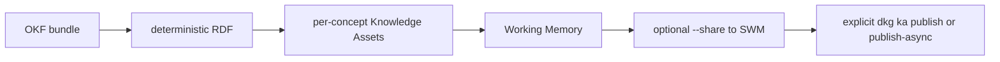

# OKF Import, Export, and Verify

`dkg okf` maps Google Open Knowledge Format bundles into named per-concept Knowledge Assets. Import uses the normal lifecycle: create, write, finalize, optional share. It never publishes directly to Verifiable Memory.



## Import

```bash
dkg okf import ./bundle --context-graph-id okf-demo --create-context-graph
dkg okf import ./bundle --context-graph-id okf-demo --share
dkg okf import ./bundle --context-graph-id private-okf --private --create-context-graph
```

Important flags:

| Flag | Meaning |
|---|---|
| `--context-graph-id <id>` | Target context graph |
| `--create-context-graph` | Create the context graph if needed |
| `--share` | Share imported per-concept KAs to SWM after WM import/finalize |
| `--replace` | Replace existing imported concept assets |
| `--manifest <path>` | Resume or inspect staged import progress from a custom manifest |
| `--private` | Create/use a private context graph for imports |
| `--sub-graph-name <name>` | Import into a registered sub-graph |
| `--relate <predicate>` | Override relation mapping for concept links |
| `--dry-run` / `--print-nquads` | Validate and print deterministic RDF without mutating the node |

Private allowlisting currently uses the OKF command's implemented flags. The broader product decision about exposing `--allowed-agent` alongside or instead of `--allowed-peer` remains open.

## Export

```bash
dkg okf export okf-demo ./out
dkg okf export okf-demo ./out --view shared-working-memory
dkg okf export okf-demo ./out --view verifiable-memory
```

Export reads a context graph view and writes an OKF bundle to the output directory. Use export views to choose Working Memory, Shared Working Memory, or Verifiable Memory.

## Verify

```bash
dkg okf verify ./bundle --context-graph-id okf-demo
dkg okf verify ./bundle --context-graph-id okf-demo --list-missing
```

Verify compares the deterministic RDF expected from the local OKF bundle with triples currently visible from the node. Current verify behavior is SWM-oriented; sub-graph scoped verify is a known follow-up gap.

## VM Capstone

After an OKF import has been shared to SWM, publish selected named KAs explicitly:

```bash
dkg ka publish-async <concept-ka-name> --context-graph-id okf-demo
```

There is no OKF import-and-publish one-shot.
