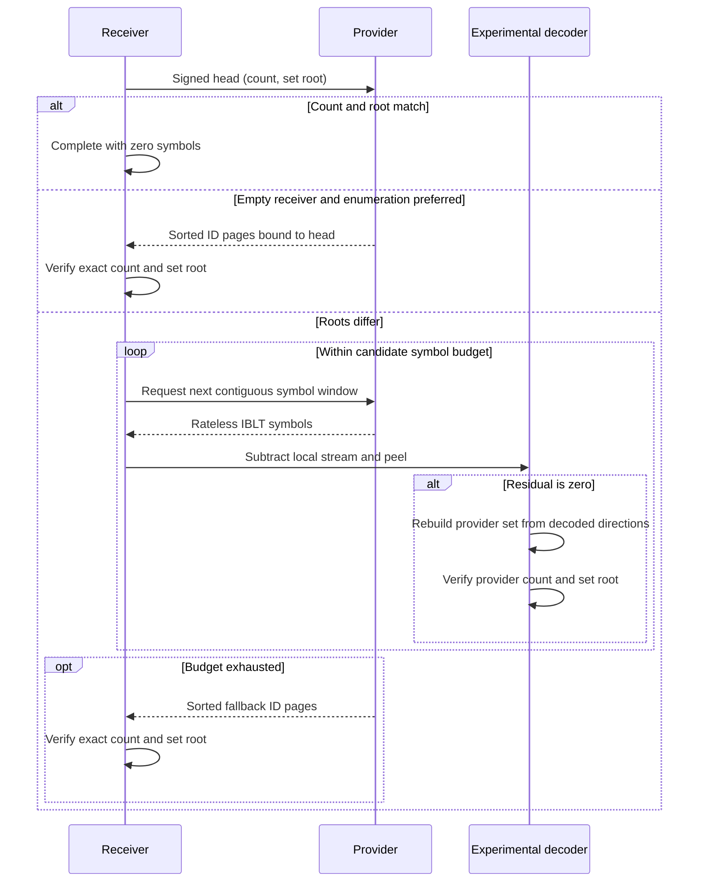

# WAL rateless IBLT profile lab

## Abstract

This directory is an isolated experiment for defining
`ProtocolV1IbltReconciliationAlgorithm` before its constants and byte vectors
become normative. It reconciles sets whose only elements are 32-byte
`WalObjectId` values. A provider emits a deterministic stream of disposable
rateless IBLT symbols; a receiver subtracts its local stream, peels pure
symbols, and learns provider-only and receiver-only IDs. An IBLT result is
accepted only after applying that difference to the receiver set reproduces
the provider's exact signed count and 16-way radix-Merkle set root. If the
decode budget is exhausted—or when an empty receiver makes enumeration the
more direct backfill path—the lab uses sorted, paginated full-ID enumeration
and verifies the same count and root.

The experiment deliberately lives outside `packages/wal`. Its algorithmic
invariants are separated from candidate values so mapping constants, request
window sizes, and fallback thresholds can be swept against realistic set sizes
and differences. Nothing here is wire-stable yet. Promotion requires reviewed
values, an explicit canonical binary encoding, stable failure codes,
cross-language vectors, adversarial resource tests, and matching independent
implementations.

`WalObjectV1` remains the sole durable content-addressed synchronization atom.
Symbols, profiles, set-commitment nodes, fallback pages, and peel progress are
disposable control or local implementation data. This lab gives none of them a
content ID or admission path.

## Flow



## Commands

From the repository root:

```sh
pnpm --filter @origintrail-experiments/wal-iblt-profile-v1 test
pnpm --filter @origintrail-experiments/wal-iblt-profile-v1 test:coverage
pnpm --filter @origintrail-experiments/wal-iblt-profile-v1 typecheck
pnpm --filter @origintrail-experiments/wal-iblt-profile-v1 vectors
pnpm --filter @origintrail-experiments/wal-iblt-profile-v1 sweep
```

The sweep writes JSON to standard output so each run can be captured with its
machine, revision, workload, and candidate profile. Do not overwrite a prior
result without retaining that provenance.

## Layout

- `PROFILE.md` records the candidate algorithm and promotion gates.
- `configs/` contains editable candidate values, never implicit defaults.
- `src/` is a DKG-semantic-free TypeScript reference implementation.
- `scripts/sweep.ts` compares candidate values.
- `vectors/` contains explicitly experimental same-implementation fixtures.
- `test/` exercises correctness, failure, incremental, and property cases.

The implementation is adapted from the paper authors' MIT-licensed Go
reference at `yangl1996/riblt`; see `THIRD_PARTY_NOTICES.md`. The DKG-specific
domain separation, 32-byte checksum, root verification, fallback, and atom
boundary are additions in this lab.
