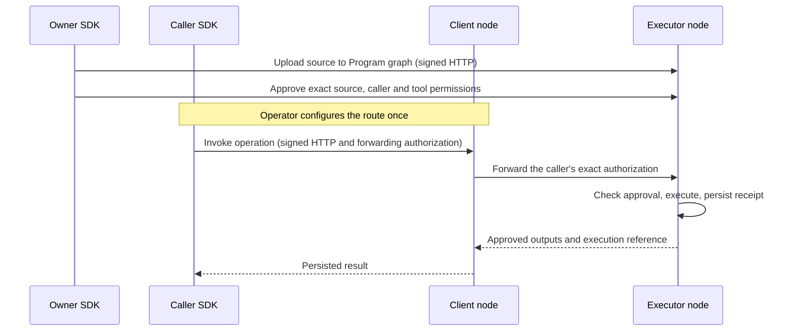

# Graph Computer SDK

A TypeScript client for browsers and Node.js, for uploading S-expression and TypeScript Programs, explicitly approving their effects, and invoking them locally or through another DKG node. Configure an agent signer once. The SDK handles RDF encoding, source hashing, request signatures, forwarding authorization, invocation IDs and response decoding.

The client needs a modern browser on a secure origin (HTTPS or localhost), or Node.js 22.13 or newer. The **executor** still needs the Graph Computer's own runtime prerequisites, including its supported Node/WASM runtime; installing this SDK does not install a node. The SDK depends on `ethers`, not the DKG daemon, SQLite or WASM packages.

This package is added to the workspace and is not yet published to npm. Build it from this checkout:

```sh
pnpm install --frozen-lockfile
pnpm --filter @origintrail-official/dkg-graph-computer build
pnpm --filter @origintrail-official/dkg-graph-computer test
```

Workspace consumers can use `"@origintrail-official/dkg-graph-computer": "workspace:*"`. For an external application, pack the package and install that tarball; no daemon checkout is required at runtime.

## Connect with an agent signer

```ts
import { readFile } from 'node:fs/promises';
import { Wallet } from 'ethers';
import { GraphComputer } from '@origintrail-official/dkg-graph-computer';

const ownerSigner = new Wallet((await readFile('/secure/owner.key', 'utf8')).trim());
const callerSigner = new Wallet((await readFile('/secure/caller.key', 'utf8')).trim());

const owner = new GraphComputer({
  nodeUrl: 'https://executor.example',
  peerId: 'EXECUTOR_PEER_ID',
  signer: ownerSigner,
});

const caller = new GraphComputer({
  nodeUrl: 'https://client.example',
  peerId: 'CLIENT_PEER_ID',
  executorPeerId: 'EXECUTOR_PEER_ID',
  signer: callerSigner,
});
```

Each signer implements `getAddress()` and `signMessage(string | Uint8Array)`. An ethers wallet or external signer works; a raw private key is never sent to a node. Both HTTP authentication and forwarding authorization use the caller's agent signer. There is no JWT issuance or bearer token flow.

Use the receiving node's physical peer ID from trusted configuration. `nodeUrl` is an HTTP(S) origin, with no path prefix. Use HTTPS or a trusted tunnel. Redirects are rejected. Browser consumers need the node's normal cross-origin configuration if using a different origin; the built-in editor uses the node's own origin.

## Edit TypeScript Programs in the node UI

Open a Context Graph and select **Program** in its action bar. To edit an existing TypeScript Program, open its Knowledge Asset and select **Edit TypeScript Program**. The source loads automatically.

1. Select an existing **Agent** on the node. The editor defaults to the current agent and uses the existing authenticated node session. The key stays on the node; no browser-wallet connection is needed. A node operator may select any local custodial agent; an agent-scoped session may select only its own identity. Source reads and execution still enforce that agent’s graph access and operation grants.
2. Write an exported `run(...args)` function in the Monaco editor. It provides TypeScript diagnostics and completion for `pipe`, `map`, `reduce` and `invoke_program`. The executor remains authoritative about which code it can compile.
3. If the Program calls other Programs, add each child Program IRI, operation graph and operation IRI. These must be existing approved operations on this node. Approval pins their binding digests.
4. Select **Save new version**. This creates a new sealed source asset in private Working Memory. Editing an existing Program records `prov:wasDerivedFrom`; it leaves the previous source intact. Saving does not approve or share a Program.
5. Enter the operation graph, operation IRI, allowed caller addresses and execution limits. Select **Check approval**, review the current policy, then **Approve Program** or **Replace approval**. Approval requires the graph owner or node operator; the executor must hold the selected execution identity. An update uses the reviewed revision and reports conflicts without silently overwriting them. Approval compiles the source and displays compilation errors.
6. Enter positional arguments as a JSON array and select **Run Program**. For the initial example, `[[1, 2, 3]]` returns `12`. The panel displays the decoded result and execution reference.

After an uncertain response, **Retry same invocation** keeps the same ID and inputs. The node signs any forwarded invocation with the selected agent key. The recovery handle is retained in this browser tab's session storage, including the submitted arguments. **New execution** deliberately allocates another ID. Changing the approval or inputs requires a new execution.

The editor loads code, language workers and styles from the node, without a CDN. It does not run uploaded Programs in the browser. The same runtime limits and child-operation permissions apply as for SDK calls.

To load source through the SDK, use the signed, graph-authorized source endpoint:

```ts
const stored = await owner.programs.getSource({
  graphId: 'PROGRAM_GRAPH_ID',
  programIri: 'urn:example:program:analysis',
  programLayer: 'wm',
});
// stored.source, stored.sourceHash, stored.version, stored.permittedPrograms
```

This calls `GET /api/programs/source`. Reading private source requires the selected agent's graph/Working Memory access. A node session must explicitly select a custodial identity; an operator token alone is not treated as an agent signature.

### Using an existing node session

For a node-integrated client, use this alternative to an external signer:

```ts
const local = new GraphComputer({
  nodeUrl: 'https://node.example', peerId: 'NODE_PEER_ID',
  localAgent: { address: 'LOCAL_AGENT_ADDRESS', authToken: existingNodeSessionToken },
});
```

This mode sends the existing bearer credential plus an explicit `X-DKG-Program-Agent` selection. It does not mint credentials or expose keys. `GET /api/programs/agents` lists only identities available to that session. Uploads name the selected author; Program source and execution routes check custody and authorization. Remote invocation uses the node's configured route and signs on the node, so omit `executorPeerId`. Use the external-signer mode above when the key is held by your application.

## Upload, approve and invoke

Assume the owner already has two private Context Graphs, `programGraph` and `dataGraph`, and a custodial execution identity on the executor. Use canonical graph IDs returned by DKG. The caller does **not** need membership in the private data graph, or a local copy of the Program.



### 1. Upload the source

```ts
const readTool = 'urn:example:tool:sparql-read';
const query = 'SELECT ?device ?temperatureC WHERE { ?device a <urn:example:Device> ; <urn:example:temperatureC> ?temperatureC . } LIMIT 10';

const program = await owner.programs.upload({
  graphId: programGraph,
  source: `(strategy example/read-devices (version "1.0.0")
    (scope graph:${dataGraph}) (goal read-devices)
    (supervise one-for-one (max-restarts 1) (window-ms 60000)
      (delegate reader (grant dkg.sparql.read)
        (call dkg/sparql-read@1 ${JSON.stringify(query)}))))`,
  requiredTools: [readTool],
});
```

The SDK creates a unique Program IRI and asset name unless supplied, stores the exact source as RDF, and finalizes it in **Working Memory**. Upload does not share the source, publish on chain, or authorize execution. The returned reference contains the exact source hash and author, ready for approval. Compilation/admission happens when the executor validates the approval.

### 2. Approve the operation once

```ts
const operationIri = 'urn:example:operation:read-devices';
const approval = await owner.programs.approve({
  graphId: dataGraph,
  operationIri,
  program,
  allowedCallers: [await callerSigner.getAddress()],
  sparqlRead: {
    toolIri: readTool, layer: 'wm', timeoutMs: 5000,
    maxResultItems: 10, maxOutputBytes: 16384,
    outputSchema: {
      type: 'object', additionalProperties: false, required: ['bindings'],
      properties: {
        bindings: {
          type: 'array', maxItems: 10,
          items: {
            type: 'object', additionalProperties: false,
            required: ['device', 'temperatureC'],
            properties: {
              device: { type: 'string', maxLength: 128 },
              temperatureC: { type: 'string', maxLength: 128 },
            },
          },
        },
      },
    },
  },
});
console.log(approval.revision, approval.resolution?.executable);
```

Approval is an explicit owner action. The executor defaults to the owner's signing address and must have that agent's custodial execution identity. The server checks ownership, source pins, caller permission, tool scope and output contract. It computes additional query/schema pins. Upload never infers these permissions.

### 3. Configure the route once

```ts
await caller.routes.create({
  graphId: dataGraph, operationIri, targetPeerId: 'EXECUTOR_PEER_ID',
});
```

Route management requires a client-node operator. The example assumes this caller is explicitly configured as one. Otherwise a separate operator client creates the route. Routine invocations need only the approved caller identity. Routing does not grant access on the executor.

### 4. Invoke

```ts
const execution = await caller.programs.invoke({ graphId: dataGraph, operationIri });
console.log(execution.invocationId, execution.executionIri);
console.log(execution.outputs);
```

For direct execution on the receiving node, omit `executorPeerId`. For remote execution, configure it on the client or pass it to `invoke`; it must match the operator-configured route. The SDK signs the exact graph, operation, invocation UUID, executor and forwarding peer. A route change does not silently authorize a different executor.

JSON outputs are decoded. Plain text remains text, and `rawOutputs` preserves every original output string. A SPARQL read output retains its provenance envelope: `{ kind: 'sparql-read', contextGraphId, layer, querySha256, result: { bindings: [...] } }`. RDF literals retain their RDF encoding. The SDK requires a matching, persisted execution receipt before returning success. Direct receipt queries still require the appropriate data-graph permissions.

## Three scenarios

[examples/programs.mjs](examples/programs.mjs) contains complete sources and approval contracts:

| Scenario | Approved behavior | Expected result with the guide's seed data |
| --- | --- | --- |
| `read-devices` | SPARQL SELECT in one graph | Both synthetic devices |
| `read-and-record` | Read device 001 and create an assessment asset with `dkg/asset-create@1` | Device result and asset output |
| `read-device-subset` | Read device 001 in line A, with an output enum restricted to that device | Device 001 only |

The examples assume devices `urn:example:device:001` and `:002` have type `urn:example:Device`, a `urn:example:temperatureC` literal, and `urn:example:line` values `urn:example:line:A` and `:B`. Seed these on the executor before running. The second example explicitly authorizes a write. It is not arbitrary SPARQL UPDATE; the third is an approved query restriction, not a new subgraph access-control mechanism.

[examples/upload-and-invoke.mjs](examples/upload-and-invoke.mjs) uploads, approves, routes and invokes all three. Set `EXECUTOR_URL`, `EXECUTOR_PEER_ID`, `CLIENT_URL`, `CLIENT_PEER_ID`, `OWNER_KEY_FILE`, `CALLER_KEY_FILE`, `PROGRAM_GRAPH` and `DATA_GRAPH`, then run it from the package directory:

```sh
node examples/upload-and-invoke.mjs
```

The script explicitly creates three approvals/routes and performs the scenario-2 asset write. It does not create graphs or grant membership. Examples remain in the source checkout; the published package surface is the SDK.

## Write a TypeScript Program

TypeScript Programs export `run(...inputs)`. Import the guest API from
`@origintrail-official/dkg-graph-computer/program`; this import supplies editor
types locally and is replaced by the compiler inside Wasm. These helpers run
inside stored Programs, not in your Node.js application.

```ts
import { invoke_program, pipe, map, reduce }
  from '@origintrail-official/dkg-graph-computer/program';

const scale = 'urn:example:program:scale:v1';

export async function run(values: unknown[], factor: number) {
  const scaled = map(value => invoke_program(scale, [value, factor]), {
    concurrency: 4,
  });
  const total = reduce((sum, value) => Number(sum) + Number(value), 0);
  return pipe(values, scaled, total);
}
```

The child Program is ordinary TypeScript too:

```ts
export function run(value: number, factor: number) {
  return value * factor;
}
```

Store both sources in the Program graph and approve the child first:

```ts
const child = await owner.programs.upload({
  graphId: programGraph,
  programIri: 'urn:example:program:scale:v1',
  language: 'typescript-v1',
  source: await readFile('./scale.ts', 'utf8'),
  requiredTools: [],
});

const childOperation = { graphId: dataGraph, operationIri: 'urn:example:scale' };
await owner.programs.approve({
  ...childOperation, program: child, allowedCallers: [await callerSigner.getAddress()],
  typescript: { children: [] },
});

const workflow = await owner.programs.upload({
  graphId: programGraph,
  language: 'typescript-v1',
  source: await readFile('./workflow.ts', 'utf8'),
  requiredTools: [],
  permittedPrograms: [child.programIri],
});
const workflowOperation = { graphId: dataGraph, operationIri: 'urn:example:scaled-total' };
await owner.programs.approve({
  ...workflowOperation, program: workflow,
  allowedCallers: [await callerSigner.getAddress()],
  typescript: {
    children: [childOperation],
    maxCalls: 64, maxConcurrency: 4, timeoutMs: 30_000,
  },
});

// The client-node operator configures this route for remote execution.
await caller.routes.create({ ...workflowOperation, targetPeerId: 'EXECUTOR_PEER_ID' });
const result = await caller.programs.invoke({
  ...workflowOperation, inputs: [[1, 2, 3], 10],
});
console.log(result.outputs); // [60]
```

The complete runnable setup is [examples/typescript/upload-and-invoke.mjs](examples/typescript/upload-and-invoke.mjs).

The owner approves exact source, child Program declarations and child operation
bindings. The server fills and stores each child's binding digest. The original
caller must be allowed by every approved child grant; a parent approval cannot
lend its executor identity to bypass a child's caller restrictions. Changing or
revoking a child grant invalidates the parent's permission until re-approved.
Managing a child reference requires ownership of its operation graph or explicit
node-operator authority.

`invoke_program(programIri, args)` returns the child's decoded JSON value when
there is one output, or an array when there are multiple outputs. It can call an
approved S-expression Program with `[]`; existing S-expression Programs retain
their fixed arguments. SPARQL results retain their provenance envelopes and RDF
term encoding. Adding PostgreSQL or LLM integrations still requires real approved
child Programs/adapters; those names do not create built-in services.

The executor compiles the source during approval using ComponentizeJS and runs
it in Wasm in an isolated process. Only the guest API import is accepted. Calls
are returned to the host, where permissions and budgets are checked. Inputs are
limited to a JSON array of 64 KiB/depth 20, returned messages to 256 KiB, and guest
linear memory to 64 MiB. The host enforces call counts, concurrency and a deadline
independently of the helpers. JSON-incompatible results such as `NaN` fail.
The same memory ceiling applies to guest module initialization during approval;
compilations have a 30-second deadline and at most two run concurrently.

TypeScript parents and children execute on the same executor in this version;
the root invocation can arrive through another DKG node. Remote arguments use
the version-4 delegation scope, which includes their canonical JSON hash.
Unparameterized calls retain the version-3 scope.

## Direct tools from TypeScript

Use `invoke_tool(toolIri, input)` for an installed tool, and `invoke_program(programIri, args)` for an approved child Program. Both can appear in the same `pipe`/`map`/`reduce` workflow. Inputs and outputs are JSON. Tool results retain their existing envelopes; SPARQL rows are in `result.bindings`.

```ts
import { invoke_tool } from '@origintrail-official/dkg-graph-computer/program';

export async function run(sparql: string) {
  return invoke_tool('urn:example:tool:device-read', { sparql });
}
```

Store the requested scope along with the source, then approve it separately:

```ts
const requiredTools = ['urn:example:tool:device-read'];
const requestedPermissions = {
  graphId: dataGraph,
  sparqlRead: {
    toolIri: requiredTools[0], layer: 'wm' as const,
    timeoutMs: 5000, maxResultItems: 10, maxOutputBytes: 16384,
    outputSchema: {
      type: 'object' as const, additionalProperties: false as const,
      required: ['bindings'], properties: {
        bindings: { type: 'array' as const, maxItems: 10, items: {
          type: 'object' as const, additionalProperties: false as const,
          required: ['device'], properties: { device: { type: 'string' as const, maxLength: 256 } },
        } },
      },
    },
  },
};
const program = await owner.programs.upload({
  graphId: programGraph, source, language: 'typescript-v1',
  requiredTools, requestedPermissions,
});
await owner.programs.approve({
  ...requestedPermissions, program,
  operationIri: 'urn:example:operation:device-read',
  allowedCallers: [callerAddress],
  typescript: { children: [], maxCalls: 16, maxConcurrency: 4, timeoutMs: 30000 },
});
const result = await caller.programs.invoke({
  graphId: dataGraph, operationIri: 'urn:example:operation:device-read',
  inputs: ['SELECT ?device WHERE { ?device a <urn:example:Device> } LIMIT 10'],
});
```

Current operation approvals support the same three tool grants for both languages:

| Grant | `invoke_tool` input | Result |
| --- | --- | --- |
| `query: { selector, outputSchema }` | `{ selector }` | `{ queryIri, result }` |
| `sparqlRead: { toolIri, layer, timeoutMs, maxResultItems, maxOutputBytes, outputSchema }` | `{ sparql }` | Existing scoped SPARQL result envelope |
| `assetCreation: { toolIri }` | `{ quads: [{ subject, predicate, object }] }` | Existing asset creation receipt |

A catalog grant permits only its fixed selector and no runtime query parameters. List its tool IRI in `requiredTools`, alongside any read/create tool IRIs. There is at most one grant per adapter. Set `executionLayer` in requested permissions when assets/receipts should be stored outside WM. Tool arguments cannot select another data graph, executor or layer. Raw SPARQL grants are read-only; writes use the asset creation adapter. PostgreSQL and model calls are not new built-in grants on this approval API.

The Program stores tool IRIs as `sr:requiresTool` and its JSON scope as `sr:requestedToolPermissions`. These triples request permissions; they never authorize execution. Approval pins the tool IRIs, source, executor, graph, layer, query definition and output contract. A scope change requires a new saved request and explicit owner approval. The editor shows these requests under **Requested tools** and includes them in **Approve Program**.

In the node UI, open **New TypeScript Program** from a Context Graph, then:

1. Select the **Operation graph**. Direct tools use this graph; source stays in the graph where you created the Program.
2. Choose **+ Add tool**. Available capabilities come from the node's authenticated `GET /api/programs/tools` catalog: **SPARQL read**, **Saved query**, or **Create Knowledge Asset**. Configure memory layer, result columns and limits in the forms. Saved queries come from the selected graph's catalog. The current runtime supports one tool of each kind per Program.
3. Use **Copy TypeScript call** and paste it inside your `run` function (put the import at the top of the file). Adjust the query pattern, parameter values or RDF triples for your application. The picker generates the tool IDs and requested permissions; it does not execute the example.
4. To compose Programs, use **+ Add child Program**, select its operation graph and choose an existing approved operation. Copy its `invoke_program` call and provide the child's arguments. Approval rechecks and pins the child's current binding.
5. **Save new version**, then select/check an operation and explicitly **Approve Program** with the permitted callers. Saving or selecting a tool never grants permission. **Run Program** uses the saved, approved version.

**Advanced** retains raw JSON and custom tool IDs. Custom IDs identify these supported capabilities; they do not register arbitrary adapters. Existing IDs and complex schemas are preserved when loading a Program. Changing the operation graph clears a saved-query selection, requiring a query from the new graph. Output contracts describe the inner query result (for SELECT, `{ bindings: [...] }`); `invoke_tool` returns an envelope with those rows under `result.bindings`.

Both languages resolve adapters through the same host registry, then use the same `RuntimeEffectBroker`, current permission checks, capability checks, input/output validation and durable write journal. Direct tools and child invocations consume the same TypeScript call/concurrency budgets. Revocation is checked during execution and before returning results. A lost write response returns `INVOCATION_REQUIRES_RECONCILIATION`, even if TypeScript catches the tool exception; retry never silently replays a failed or interrupted workflow.

## Retry and recovery

`invoke()` generates a UUID before the first request. Transient network/gateway failures retry with **the same UUID**, a fresh HTTP nonce/signature and fresh forwarding authorization. Defaults: two additional attempts, 60 seconds per attempt, exponential delay starting at 250 ms. Server `Retry-After` is honored; delays longer than five seconds are returned to the application instead of retried early.

For recovery across application restarts, persist the handle before sending:

```ts
const invocation = caller.programs.prepareInvocation({ graphId: dataGraph, operationIri });
await saveInYourDatabase(invocation);
const execution = await caller.programs.invoke(invocation);
// Later, retry by passing exactly the saved handle again.
```

`GraphComputerError` exposes `code`, HTTP `status` when available, server `details`, and `invocationId` for execution errors. Timeouts and cancellation do not prove that the executor stopped or that no write occurred. Recover using the same invocation ID. Do not create a new UUID automatically after a failure.

Permission denials, revision conflicts, execution failures and reconciliation errors are returned without automatic retries. Upload and approval/route mutations are **never automatically retried** after an ambiguous failure. Inspect server state before repeating them. The SDK does not promise exactly-once effects; the executor owns persistence, idempotency and reconciliation.

For TypeScript, a completed result is persisted and can be retrieved with the
same invocation ID and inputs after a node restart. Reusing an ID with different
inputs is rejected. Pending JavaScript callbacks are not checkpointed: failed or
interrupted executions return `INVOCATION_NOT_RETRYABLE` and never automatically
repeat tool or child effects. Inspect the durable effect journal and child execution records before deliberately starting
a new invocation. Parent receipts link successful child execution references.

Every network method accepts `{ signal: AbortSignal }` as its second argument. Constructor options include `timeoutMs`, `retries`, `retryDelayMs`, `maxResponseBytes` (default 4 MiB) and an optional `fetch` implementation.

## Updating and revoking

Create a new Program IRI for changed source. Read the current approval, review the new reference and permissions, then call `programs.updateApproval({ ...approvalInput, expectedRevision })`. A conflict is surfaced; the SDK never refreshes a revision and overwrites another operator's change automatically.

```ts
const current = await owner.programs.getApproval({ graphId: dataGraph, operationIri });
await owner.programs.revoke({
  graphId: dataGraph, operationIri, expectedRevision: current.revision,
});
```

The corresponding methods are `programs.listApprovals`, `routes.get`, `routes.list`, `routes.update` and `routes.remove`. Update/remove require `expectedRevision`. Server responses retain their canonical wire fields (`contextGraphId`, `binding`, `route`, `bindingDigest`, etc.). A revoked binding can be explicitly re-approved with `updateApproval` and its current revision; `approve` only creates a new binding.

## Current limits

Calls select an approved operation. TypeScript operations accept bounded JSON
arguments; S-expression operations retain fixed arguments. Callers cannot supply
new permission grants or select output layers at invocation time. Source changes
and child-permission changes require owner review. Program sharing, graph creation
and on-chain publication remain separate workflows. TypeScript execution requires
the updated executor runtime from this checkout; it is not available on an older
deployment merely by installing the SDK.

## Validation

The package tests exercise signing compatibility with the daemon, loss of an HTTP response after an effect, retries, cancellation, deadlines, response limits and revision handling. The CLI's `semantic-runtime-configuration-api.test.ts` also runs all three example Programs using this SDK through the real authentication, upload, approval and invocation handlers, the real query engine and WASM runtime. That harness uses fixture nodes and an in-process inbox transport; it verifies persisted results, an asset read-back, idempotent retries, private-data denial and revocation. These are local integration tests, not a claim of a new deployment or a live network run.

The same harness executes a TypeScript parent calling both an approved SPARQL
Program and a TypeScript child. It checks signed-input tampering, caller
restrictions, child revocation, completed replay after restart, and refusal to
repeat a failed workflow. The runtime tests exercise real Wasm concurrency,
import restrictions, build/execution timeouts, and memory limits during both
compilation and invocation.
