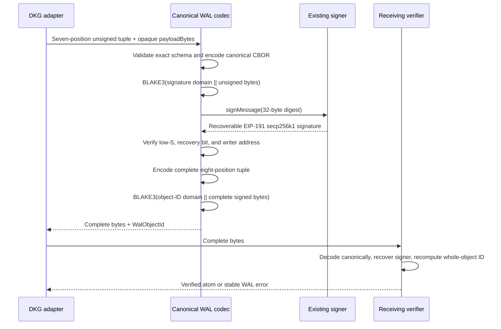
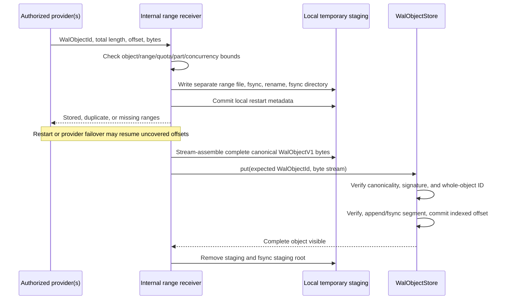
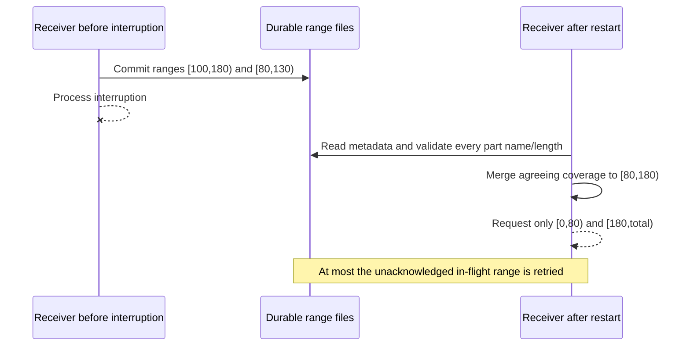
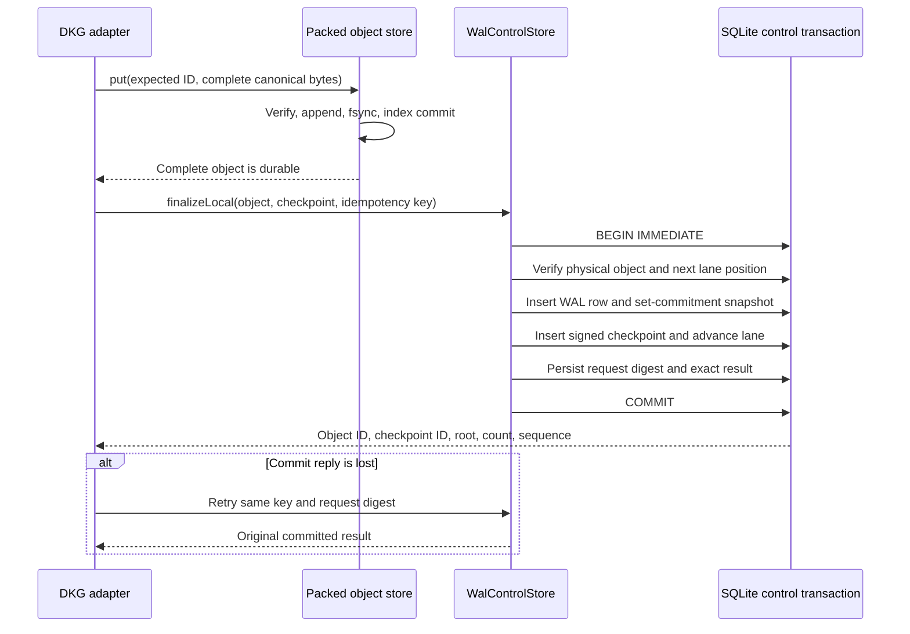
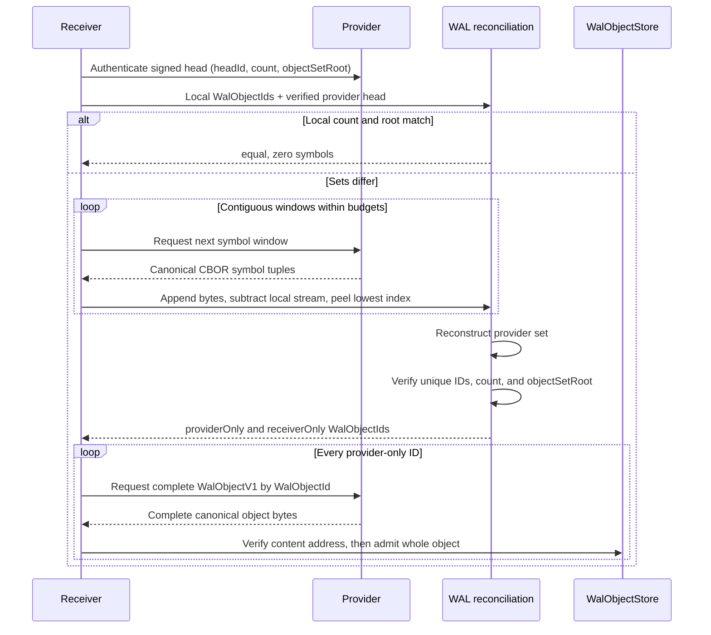
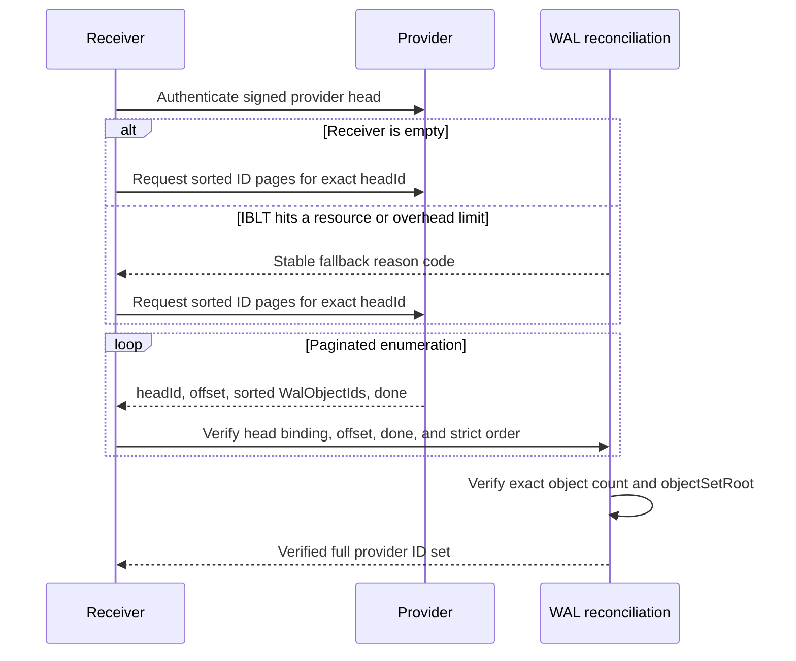

# DKG WAL reconciliation

## Abstract

`@origintrail-official/dkg-wal` implements the application-agnostic WAL-005
set-reconciliation layer. The only element it reconciles is a 32-byte
`WalObjectId`. A provider and receiver compare a head-bound object count and
16-way radix-Merkle set root; when they differ, the provider streams canonical
rateless IBLT symbols and the receiver incrementally subtracts its local set
and peels provider-only and receiver-only IDs. A decode is accepted only when
the reconstructed set exactly matches the provider head. Empty receivers,
resource exhaustion, excessive symbol overhead, and undecodable residuals use
strictly sorted, paginated full-ID enumeration bound to the same head.

The synchronization atom remains one complete, canonical `WalObjectV1` byte
string. Reconciliation symbols, pages, commitment nodes, mapping cursors, and
peel state are disposable control data: they have no content IDs and cannot be
stored or synchronized independently. This package does not import RDF,
SPARQL, SWM/VM reducers, network transports, object payloads, or DKG semantic
logic. A caller authenticates the signed head, runs this module over IDs, and
then fetches each complete missing `WalObjectV1` through its object-transfer
layer. SPARQL conflict handling remains a downstream adapter concern.

## Atom and trust boundary

```text
Durable synchronized atom:  WalObjectV1 bytes -> WalObjectId
Reconciled set element:      WalObjectId (exactly 32 bytes)
Disposable protocol data:   symbols, windows, pages, roots, cursors, traces
Authenticated by caller:    signed reconciliation head and peer/session roles
Verified by this package:    count, object-set root, head binding, decoded IDs
Out of scope:                object transfer, discovery, RDF/SPARQL, SWM/VM
```

There is no payload offset in a reconciliation element. Large objects are
still transferred as complete `WalObjectV1` values by the object-transfer
protocol. Chunking may be a transport optimization, but chunks are not durable
atoms, do not enter the reconciled set, and are accepted only after the full
object is reconstructed and its `WalObjectId` is verified.

## Runtime isolation scaffold

The daemon-facing runtime has three explicit modes. Omitting `sync.mode` is
identical to `legacy`: no WAL runtime is registered and no WAL directory,
worker, timer, port, or protocol is created. `parallel` registers an isolated
shadow runtime while all production reads, writes, graph synchronization, and
DKG semantic decisions remain legacy-authoritative. `wal` is the future
cutover mode; it fails closed unless the caller injects a verifier that accepts
a signed cutover artifact. A configured `cutoverId` by itself never enables
WAL authority.

Every non-legacy runtime is confined below `<DKG_HOME>/wal-v1/`:

```text
wal-v1/
  objects/         complete WalObjectV1 storage (packed index/segments)
  range-staging/   incomplete range-transfer state
  quarantine/      rejected or unresolved objects
  shadow-rdf/      non-authoritative adapter projection
  control/         atomic runtime lifecycle marker
```

Configured component paths are resolved below that fixed root. Startup rejects
absolute escapes, `..` escapes, overlapping components, symlink traversal,
unsupported protocol or adapter versions, and malformed cutover identifiers
with stable `WAL_*` error codes. WAL-002 deliberately starts no reconciliation
or transfer worker and registers no network protocol; those are subsequent
tasks. The scaffold only makes lifecycle, isolation, authority, and operator
visibility enforceable before that work begins.

## Canonical protocol identities

WAL-003 implements the production byte and identity layer exported as
`@origintrail-official/dkg-wal/protocol`. Every frozen protocol object is an
exact-arity RFC 8949 deterministic-CBOR tuple. Decoding rejects non-shortest
integers, indefinite forms, maps, tags, floats, invalid or non-NFC UTF-8,
missing/extra positions, invalid fixed widths, and unsorted or duplicate
set-like arrays. JSON is not a signed, hashed, or wire representation.

The durable synchronization atom has exactly one version-1 shape:

```text
WalObjectV1 = [
  version,
  namespaceId,
  writerId,
  writerEpoch,
  sequence,
  previousObjectIdOrNull,
  payloadBytes,
  signature
]
```

`payloadBytes` is opaque and inline. It has no payload/blob/chunk identity and
is never decoded by the generic WAL layer. Changing one payload byte changes
the signature input and therefore the complete signed `WalObjectId`.



The signer boundary accepts Ethers-style `getAddress()` signers, the repository
publisher shape with an `address` property, and the EVM adapter's
`getSignerAddress()` plus compact `{r, vs}` result. Threshold verification
receives the current authorized signer set and threshold from its caller. This
module recovers and checks signatures; it does not select, rotate, weaken, or
redefine DKG authority.

## Durable complete-object store and resumable ranges

WAL-004 exports one deliberately small storage abstraction:

```ts
abstract class WalObjectStore {
  abstract has(id: WalObjectId): Promise<boolean>;
  abstract read(id: WalObjectId, offset?: bigint, length?: number): AsyncIterable<Uint8Array>;
  abstract put(expectedId: WalObjectId, bytes: AsyncIterable<Uint8Array>): Promise<void>;
  abstract ids(): AsyncIterable<WalObjectId>;
}
```

`PackedWalObjectStore` is the scalable local implementation. It stores many
complete canonical objects in append-only segment files and maintains a SQLite
B-tree from `WalObjectId` to `(segmentId, objectOffset, objectLength)`. Segment
IDs, record headers, offsets, index rows, and SQLite pages are local storage
details: none is signed, advertised, reconciled, or transferred.

The local binary layout is fixed-width and integer-only. Multi-byte integers
are unsigned big-endian:

| Structure | Offset | Bytes | Value |
|---|---:|---:|---|
| `PackedSegmentHeaderV1` | 0 | 8 | ASCII `DKGWSEG1` (magic plus format version) |
| | 8 | 4 | schema version `1` |
| | 12 | 4 | reserved zero bytes |
| | 16 | 8 | local segment ID |
| | 24 | 8 | reserved zero bytes |
| `PackedRecordHeaderV1` | 0 | 8 | ASCII `DKGWREC1` (magic plus format version) |
| | 8 | 32 | complete `WalObjectId` |
| | 40 | 8 | canonical object byte length |
| record body | 48 | length | unchanged canonical `WalObjectV1` bytes |

The segment header intentionally does not contain a growing object/offset
catalog: appending an object would otherwise require rewriting shared header
pages and introducing a second commit protocol. SQLite is the authoritative
local catalog, and its B-tree pages supply ordered IDs and bounded point
lookups. The per-record header independently binds the indexed ID and length to
the bytes found at that offset.

Admission streams into a bounded candidate file, verifies canonicality,
signature, writer, and complete-object ID, appends and fsyncs the segment, then
commits the index row in SQLite `WAL` mode with `synchronous=FULL`. The ordering
guarantees that an index row never references unflushed bytes. A crash before
the index commit leaves an unindexed tail, which restart truncates to the last
committed boundary. Segments rotate at a configured target size; an object
larger than the target receives its own segment without being split into a new
protocol atom.

`has()` is an indexed point lookup, `read()` validates the local record header
and performs bounded positional reads, and `ids()` is a strict byte-ordered
index cursor. `FileWalObjectStore` remains available as a simple/reference
backend, but it creates one filesystem file per object and is not the scalable
default for million-object deployments.

```mermaid
sequenceDiagram
    participant A as Adapter or range finalizer
    participant C as Candidate file
    participant P as Active packed segment
    participant I as SQLite object index
    A->>C: Stream complete canonical WalObjectV1
    C->>C: fsync and verify canonical bytes, signature, writer, WalObjectId
    A->>P: Append local record header and unchanged object bytes
    P->>P: fsync segment
    A->>I: BEGIN IMMEDIATE; insert ID to segment/offset/length
    I->>I: COMMIT with WAL and synchronous FULL
    I-->>A: Object visible to has/read/ids
    Note over P,I: Crash before commit leaves only an unindexed tail
    A->>P: Restart truncates tail to indexed committed_end
```

The range receiver is package-internal. It stores bounded range files and local
JSON restart metadata under `range-staging/`; those files are not protocol
objects, are not reconciled, and have no content IDs. Agreeing overlaps and
duplicates are accepted, conflicting overlaps fail, missing ranges survive a
restart, and only complete reconstructed bytes may enter the public store.





The default object policy is 1 GiB with an 8 GiB protocol hard ceiling; ranges
are at most 1 MiB. Staging additionally caps physical bytes, parts per object,
simultaneous incomplete objects, lifetime, and assembly/verification buffers.
No sparse final or staging file is used.

## Crash-safe WAL control state

WAL-006 adds `WalControlStore`, exported from
`@origintrail-official/dkg-wal/control`. It reuses the packed store's
`objects.sqlite` database so every accepted logical WAL row has a foreign key
to an already durable complete-object record. The packed-store schema remains
version 1; the control layer has its own explicit `wal_control_schema` version
and transactional migration boundary. Connections use SQLite WAL mode,
`synchronous=FULL`, foreign keys, `BEGIN IMMEDIATE`, and a process-local
per-database writer mutex for asynchronous local finalization.

The control schema records complete admitted objects, received range metadata,
author lanes, set-commitment snapshots, signed checkpoints, bounded IBLT cache,
head vectors, idempotency results, staged admission, materialization progress,
peer/provider state, persistent retry work, quarantine metadata, and GC work.
Ranges, cache entries, quarantine rows, and their referenced package-internal
artifacts have explicit expiry and bounded ownership. Packed segment recovery
owns unindexed segment-tail cleanup; the range receiver owns orphan range-file
cleanup; `WalControlStore.cleanupExpired()` owns their durable control rows.

Local publication first makes the complete `WalObjectV1` bytes durable in the
packed store. A single control transaction then verifies the exact next lane
sequence/link, restores and advances the object-set commitment, inserts the
object and signed checkpoint, advances the author lane, and records the
idempotency result. It performs no graph or network work. A retry after a lost
commit acknowledgement returns the original committed IDs, set root, count,
and sequence; reuse of the key for a different request digest fails closed.



Remote bytes enter separately. An adapter stages proof, closure, and provider
metadata; only a fully verified, physically present batch moves from `STAGED`
to `ADMITTED` in the same transaction that creates its logical WAL rows. Later
authority and causal-closure rules are implemented by WAL-007 through WAL-011;
WAL-006 provides their durable fail-closed boundary without weakening them.

Rollback protection is deliberately outside ordinary WAL/graph snapshots.
`rollback-high-water.sqlite` is mode `0600`, uses its own versioned schema and
WAL/FULL durability, and is paired to control state by a random 16-byte guard.
A missing, substituted, mismatched, malformed, or decreasing high-water store
blocks use; it is never recreated over an existing guard. Integrity scans also
block on SQLite, foreign-key, physical-object, lane-count, membership, or
commitment-snapshot inconsistency and never mutate RDF.

```mermaid
sequenceDiagram
    participant R as Restarting runtime
    participant C as objects.sqlite control state
    participant H as rollback-high-water.sqlite
    participant Q as Persistent retry queues
    R->>C: Validate packed schema and control schema version
    R->>C: PRAGMA quick_check and foreign_key_check
    R->>H: Validate schema, permissions boundary, and paired guard
    alt Any integrity or rollback guard failure
        R-->>R: State = blocked; no graph mutation or authority claim
    else State is valid
        R->>Q: Return expired leases to READY
        R->>C: Expire bounded range/cache/quarantine metadata
        R-->>R: State = complete and replay may resume
    end
```

## IBLT sequence



## Backfill and fallback sequence



Backfill is therefore an explicit first-class path, not an attempt to encode
the entire retained set as an IBLT difference.

## Protocol shape

- `ProtocolV1IbltReconciliationAlgorithm` fixes bytes32 IDs/checksums,
  signed-i64 counts, deterministic CBOR tuples, the rateless mapping schedule,
  and lowest-symbol-index-first peeling.
- `RatelessIbltEncoder` emits contiguous symbol or canonical byte windows.
- `RatelessIbltDecoder` appends windows without discarding earlier work and
  exposes no accepted result until all received residual cells decode.
- `MutableSetCommitment` supports insertion, deletion, reference-compatible
  roots, and deterministic restart snapshots. Leaves contain at most 256 IDs.
- `ReconciliationHead` binds `headId`, exact object count, and object-set root.
- `createFallbackPages` and `verifyFallbackPages` implement head-bound exact
  enumeration.
- `reconcileSets` applies equal/IBLT/fallback policy and returns stable reason
  codes with resource usage.

Budgets independently cap symbols, decoded IDs, operations, accounted memory,
and elapsed time. Malformed input, non-canonical bytes, overflow, duplicate
output, count/root mismatch, and fallback corruption have stable machine
codes in `RECONCILIATION_ERROR_CODES`.

## Candidate tuning

Wire and safety invariants live in this package. Values that need empirical
iteration—mapping candidates, stream-window policy, and fallback thresholds—
are recorded under `experiments/wal-iblt-profile-v1/configs/` and compared by
that directory's sweep. This keeps experimental values explicit without
forking the implementation.

## Verification

```sh
pnpm --filter @origintrail-official/dkg-wal build
pnpm --filter @origintrail-official/dkg-wal test:types
pnpm --filter @origintrail-official/dkg-wal test:coverage
pnpm --filter @origintrail-official/dkg-wal test:e2e
pnpm --filter @origintrail-official/dkg-wal test:stress
pnpm --filter @origintrail-official/dkg-wal test:fixtures
pnpm --filter @origintrail-official/dkg-wal test:conformance
pnpm --filter @origintrail-official/dkg-wal-v1-conformance verify
pnpm --filter @origintrail-official/dkg-wal benchmark:reconciliation:matrix
pnpm --filter @origintrail-official/dkg-wal benchmark:store:matrix
```

The executable source has 100% statement, branch, function, and line coverage.
The stress suite runs 100,000 deterministic reconciliation seeds and fixed
`k=32` at `N=10^4`, `10^5`, and `10^6`. The E2E suite exchanges encoded symbol
windows, transfers only complete objects, proves empty-receiver backfill, and
rejects corrupt object bytes. Two separately written TypeScript consumers
reproduce the language-neutral vectors under `conformance/wal-v1`; no new
production or conformance language is required.

## Tracked benchmark

`benchmarks/reconciliation-baseline.json` records raw phase timings, summary
distributions, wire bytes, resource usage, host metadata, and a maximum 1.5x
total-time regression ratio. Every size executes in a fresh process over a
sorted streaming input so a smaller run cannot retain heap or JIT state into a
larger run. The initial Apple M3, 16 GiB, arm64, Node 25 baseline for a
symmetric difference of 32 is:

| Set size | Encoder setup | Decoder setup | Symbol stream | Total | Symbols | Canonical bytes | Peak RSS |
|---:|---:|---:|---:|---:|---:|---:|---:|
| 10,000 | 0.078 s | 0.065 s | 0.046 s | 0.189 s | 47 | 3,454 | 107.8 MiB |
| 100,000 | 0.645 s | 0.625 s | 0.445 s | 1.714 s | 65 | 4,788 | 122.3 MiB |
| 1,000,000 | 6.105 s | 6.048 s | 4.269 s | 16.422 s | 52 | 3,882 | 292.0 MiB |
| 10,000,000 | 67.055 s | 61.316 s | 47.737 s | 176.109 s | 56 | 4,232 | 1,721.5 MiB |

The setup figures cover constructing one provider and one receiver coding
window; total time includes scenario setup and streaming. Use
`benchmark:reconciliation` for a quick 10k/100k report,
`benchmark:reconciliation:matrix` for 10k/100k/1M/10M, and
`benchmark:reconciliation:rotated` for three repetitions whose starting size
rotates on every repetition. Raw runs and min/median/p95/max summaries appear
in the same JSON report. `benchmark:reconciliation:check` runs the full matrix
against the tracked regression gate; `benchmark:reconciliation:check:quick`
checks only 10k/100k. Arbitrary repetitions and sizes are also supported, for
example:

```sh
pnpm --filter @origintrail-official/dkg-wal benchmark:reconciliation:matrix -- --repetitions=5
pnpm --filter @origintrail-official/dkg-wal benchmark:reconciliation -- --sizes=10000,1000000
```

Timing comparisons require comparable hardware, runtime, power, and thermal
conditions. Symbol and byte counts are fully deterministic across machines.

## Packed object-store benchmark

`benchmarks/store-baseline.json` tracks `N = 10K, 100K, 1M, 10M` SQLite-index
cardinalities, each in a fresh process. Cardinality setup is reported as
`inventoryPreparationMs` and excluded from measured `totalMs`.

The setup uses benchmark-only index aliases to measure B-tree cardinality
without pretending to admit ten million copies of one object. All `put`,
`read`, large-object, and transfer-assembly measurements use genuine canonical,
signature-verified objects. Alias IDs are enumerated and used for `has()` only;
the record-header binding prevents reading them as content.

The Apple M3, 16 GiB, Node 24.11.1 baseline is:

| Indexed IDs | Ordered `ids()` | `has` hit p95 | Verified `put` p95 | 8 MiB verified `put` | Max RSS |
|---:|---:|---:|---:|---:|---:|
| 10,000 | 9.5 ms | 0.0057 ms | 14.1 ms | 27.4 MiB/s | 225 MiB |
| 100,000 | 97.6 ms | 0.0060 ms | 13.8 ms | 27.7 MiB/s | 234 MiB |
| 1,000,000 | 936.7 ms | 0.0073 ms | 15.0 ms | 27.5 MiB/s | 235 MiB |
| 10,000,000 | 10.24 s | 0.1129 ms | 18.8 ms | 27.4 MiB/s | 240 MiB |

`ids()` is necessarily O(N) because it emits every ID; the baseline shows
approximately linear index-cursor scaling. Point lookups, verified admissions,
and large-object throughput remain separate measurements. The range-assembly
result is also separately labelled because it belongs to transfer staging, not
to the four-method `WalObjectStore` abstraction.

Use `benchmark:store` for 10K/100K, `benchmark:store:matrix` for the complete
matrix, `benchmark:store:rotated` for three rotated repetitions,
`benchmark:store:check` for the full regression gate, and
`benchmark:store:check:quick` for 10K/100K.
