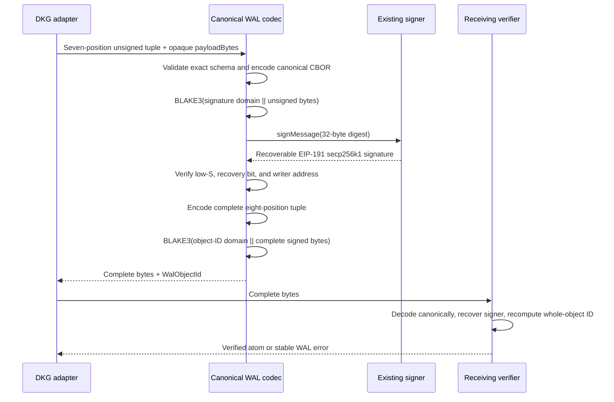
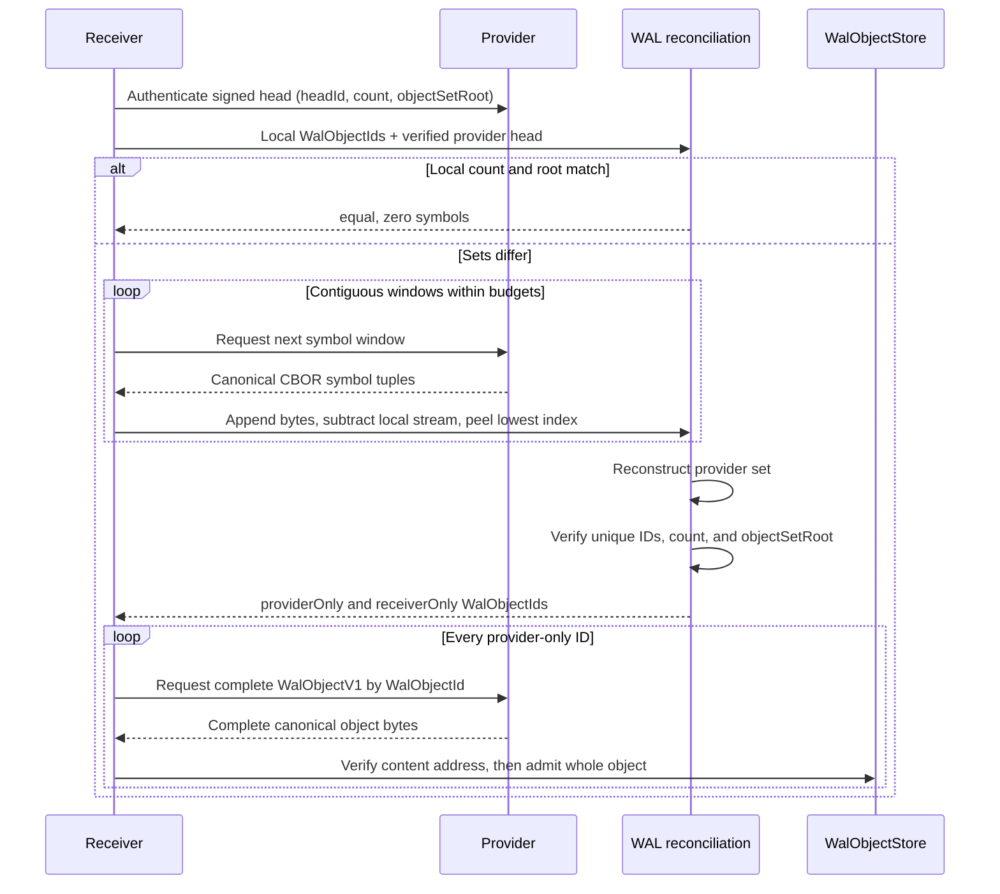
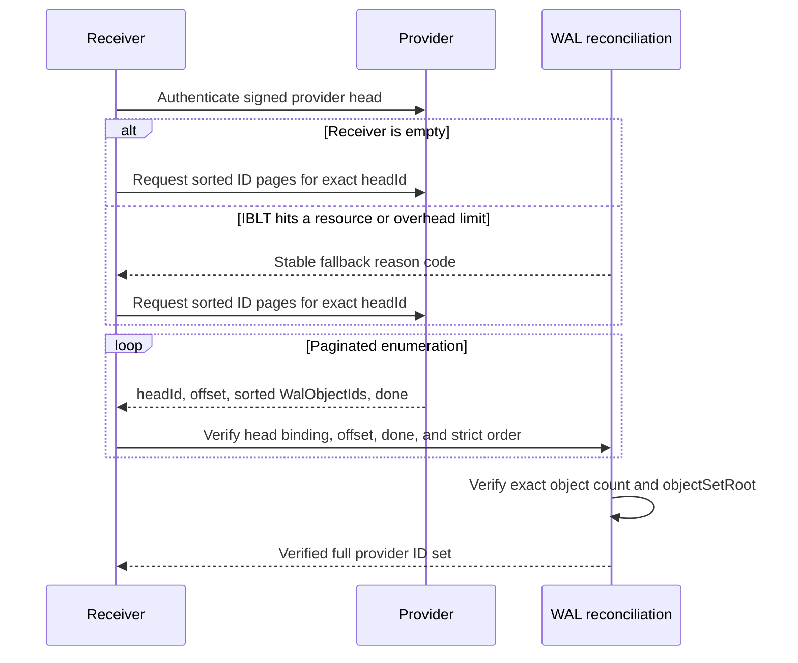

# DKG WAL reconciliation

## Abstract

`@origintrail-official/dkg-wal` implements the application-agnostic WAL-005
set-reconciliation layer. The only element it reconciles is a 32-byte
`WalObjectId`. A provider and receiver compare a head-bound object count and
16-way radix-Merkle set root; when they differ, the provider streams canonical
rateless IBLT symbols and the receiver incrementally subtracts its local set
and peels provider-only and receiver-only IDs. A decode is accepted only when
the reconstructed set exactly matches the provider head. Empty receivers,
resource exhaustion, excessive symbol overhead, and undecodable residuals use
strictly sorted, paginated full-ID enumeration bound to the same head.

The synchronization atom remains one complete, canonical `WalObjectV1` byte
string. Reconciliation symbols, pages, commitment nodes, mapping cursors, and
peel state are disposable control data: they have no content IDs and cannot be
stored or synchronized independently. This package does not import RDF,
SPARQL, SWM/VM reducers, network transports, object payloads, or DKG semantic
logic. A caller authenticates the signed head, runs this module over IDs, and
then fetches each complete missing `WalObjectV1` through its object-transfer
layer. SPARQL conflict handling remains a downstream adapter concern.

## Atom and trust boundary

```text
Durable synchronized atom:  WalObjectV1 bytes -> WalObjectId
Reconciled set element:      WalObjectId (exactly 32 bytes)
Disposable protocol data:   symbols, windows, pages, roots, cursors, traces
Authenticated by caller:    signed reconciliation head and peer/session roles
Verified by this package:    count, object-set root, head binding, decoded IDs
Out of scope:                object transfer, discovery, RDF/SPARQL, SWM/VM
```

There is no payload offset in a reconciliation element. Large objects are
still transferred as complete `WalObjectV1` values by the object-transfer
protocol. Chunking may be a transport optimization, but chunks are not durable
atoms, do not enter the reconciled set, and are accepted only after the full
object is reconstructed and its `WalObjectId` is verified.

## Runtime isolation scaffold

The daemon-facing runtime has three explicit modes. Omitting `sync.mode` is
identical to `legacy`: no WAL runtime is registered and no WAL directory,
worker, timer, port, or protocol is created. `parallel` registers an isolated
shadow runtime while all production reads, writes, graph synchronization, and
DKG semantic decisions remain legacy-authoritative. `wal` is the future
cutover mode; it fails closed unless the caller injects a verifier that accepts
a signed cutover artifact. A configured `cutoverId` by itself never enables
WAL authority.

Every non-legacy runtime is confined below `<DKG_HOME>/wal-v1/`:

```text
wal-v1/
  objects/         content-addressed complete WalObjectV1 bytes
  range-staging/   incomplete range-transfer state
  quarantine/      rejected or unresolved objects
  shadow-rdf/      non-authoritative adapter projection
  control/         atomic runtime lifecycle marker
```

Configured component paths are resolved below that fixed root. Startup rejects
absolute escapes, `..` escapes, overlapping components, symlink traversal,
unsupported protocol or adapter versions, and malformed cutover identifiers
with stable `WAL_*` error codes. WAL-002 deliberately starts no reconciliation
or transfer worker and registers no network protocol; those are subsequent
tasks. The scaffold only makes lifecycle, isolation, authority, and operator
visibility enforceable before that work begins.

## Canonical protocol identities

WAL-003 implements the production byte and identity layer exported as
`@origintrail-official/dkg-wal/protocol`. Every frozen protocol object is an
exact-arity RFC 8949 deterministic-CBOR tuple. Decoding rejects non-shortest
integers, indefinite forms, maps, tags, floats, invalid or non-NFC UTF-8,
missing/extra positions, invalid fixed widths, and unsorted or duplicate
set-like arrays. JSON is not a signed, hashed, or wire representation.

The durable synchronization atom has exactly one version-1 shape:

```text
WalObjectV1 = [
  version,
  namespaceId,
  writerId,
  writerEpoch,
  sequence,
  previousObjectIdOrNull,
  payloadBytes,
  signature
]
```

`payloadBytes` is opaque and inline. It has no payload/blob/chunk identity and
is never decoded by the generic WAL layer. Changing one payload byte changes
the signature input and therefore the complete signed `WalObjectId`.



The signer boundary accepts Ethers-style `getAddress()` signers, the repository
publisher shape with an `address` property, and the EVM adapter's
`getSignerAddress()` plus compact `{r, vs}` result. Threshold verification
receives the current authorized signer set and threshold from its caller. This
module recovers and checks signatures; it does not select, rotate, weaken, or
redefine DKG authority.

## IBLT sequence



## Backfill and fallback sequence



Backfill is therefore an explicit first-class path, not an attempt to encode
the entire retained set as an IBLT difference.

## Protocol shape

- `ProtocolV1IbltReconciliationAlgorithm` fixes bytes32 IDs/checksums,
  signed-i64 counts, deterministic CBOR tuples, the rateless mapping schedule,
  and lowest-symbol-index-first peeling.
- `RatelessIbltEncoder` emits contiguous symbol or canonical byte windows.
- `RatelessIbltDecoder` appends windows without discarding earlier work and
  exposes no accepted result until all received residual cells decode.
- `MutableSetCommitment` supports insertion, deletion, reference-compatible
  roots, and deterministic restart snapshots. Leaves contain at most 256 IDs.
- `ReconciliationHead` binds `headId`, exact object count, and object-set root.
- `createFallbackPages` and `verifyFallbackPages` implement head-bound exact
  enumeration.
- `reconcileSets` applies equal/IBLT/fallback policy and returns stable reason
  codes with resource usage.

Budgets independently cap symbols, decoded IDs, operations, accounted memory,
and elapsed time. Malformed input, non-canonical bytes, overflow, duplicate
output, count/root mismatch, and fallback corruption have stable machine
codes in `RECONCILIATION_ERROR_CODES`.

## Candidate tuning

Wire and safety invariants live in this package. Values that need empirical
iteration—mapping candidates, stream-window policy, and fallback thresholds—
are recorded under `experiments/wal-iblt-profile-v1/configs/` and compared by
that directory's sweep. This keeps experimental values explicit without
forking the implementation.

## Verification

```sh
pnpm --filter @origintrail-official/dkg-wal build
pnpm --filter @origintrail-official/dkg-wal test:types
pnpm --filter @origintrail-official/dkg-wal test:coverage
pnpm --filter @origintrail-official/dkg-wal test:e2e
pnpm --filter @origintrail-official/dkg-wal test:stress
pnpm --filter @origintrail-official/dkg-wal test:fixtures
pnpm --filter @origintrail-official/dkg-wal test:conformance
pnpm --filter @origintrail-official/dkg-wal-v1-conformance verify
pnpm --filter @origintrail-official/dkg-wal benchmark:reconciliation:matrix
```

The executable source has 100% statement, branch, function, and line coverage.
The stress suite runs 100,000 deterministic reconciliation seeds and fixed
`k=32` at `N=10^4`, `10^5`, and `10^6`. The E2E suite exchanges encoded symbol
windows, transfers only complete objects, proves empty-receiver backfill, and
rejects corrupt object bytes. Two separately written TypeScript consumers
reproduce the language-neutral vectors under `conformance/wal-v1`; no new
production or conformance language is required.

## Tracked benchmark

`benchmarks/reconciliation-baseline.json` records raw phase timings, summary
distributions, wire bytes, resource usage, host metadata, and a maximum 1.5x
total-time regression ratio. Every size executes in a fresh process over a
sorted streaming input so a smaller run cannot retain heap or JIT state into a
larger run. The initial Apple M3, 16 GiB, arm64, Node 25 baseline for a
symmetric difference of 32 is:

| Set size | Encoder setup | Decoder setup | Symbol stream | Total | Symbols | Canonical bytes | Peak RSS |
|---:|---:|---:|---:|---:|---:|---:|---:|
| 10,000 | 0.078 s | 0.065 s | 0.046 s | 0.189 s | 47 | 3,454 | 107.8 MiB |
| 100,000 | 0.645 s | 0.625 s | 0.445 s | 1.714 s | 65 | 4,788 | 122.3 MiB |
| 1,000,000 | 6.105 s | 6.048 s | 4.269 s | 16.422 s | 52 | 3,882 | 292.0 MiB |
| 10,000,000 | 67.055 s | 61.316 s | 47.737 s | 176.109 s | 56 | 4,232 | 1,721.5 MiB |

The setup figures cover constructing one provider and one receiver coding
window; total time includes scenario setup and streaming. Use
`benchmark:reconciliation` for a quick 10k/100k report,
`benchmark:reconciliation:matrix` for 10k/100k/1M/10M, and
`benchmark:reconciliation:rotated` for three repetitions whose starting size
rotates on every repetition. Raw runs and min/median/p95/max summaries appear
in the same JSON report. `benchmark:reconciliation:check` runs the full matrix
against the tracked regression gate; `benchmark:reconciliation:check:quick`
checks only 10k/100k. Arbitrary repetitions and sizes are also supported, for
example:

```sh
pnpm --filter @origintrail-official/dkg-wal benchmark:reconciliation:matrix -- --repetitions=5
pnpm --filter @origintrail-official/dkg-wal benchmark:reconciliation -- --sizes=10000,1000000
```

Timing comparisons require comparable hardware, runtime, power, and thermal
conditions. Symbol and byte counts are fully deterministic across machines.
